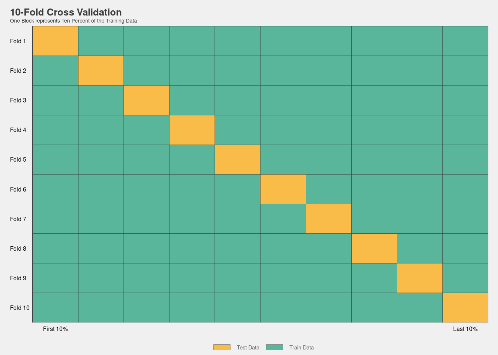
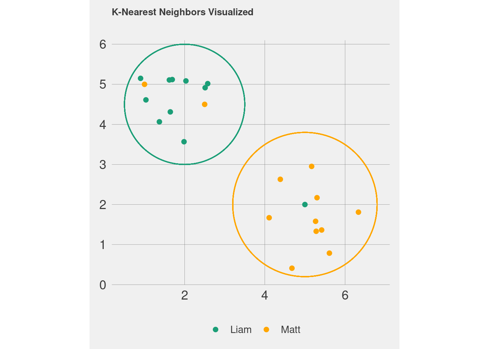
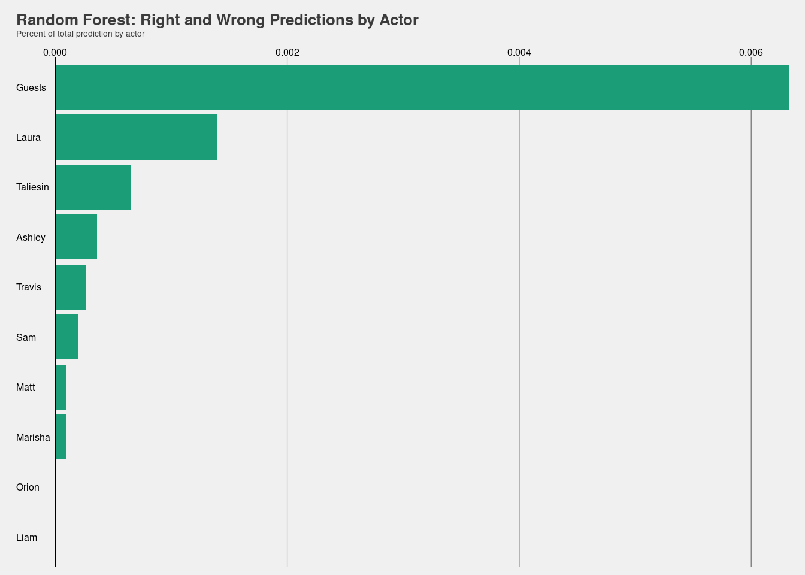
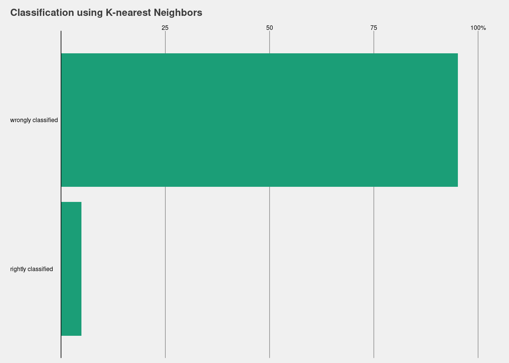
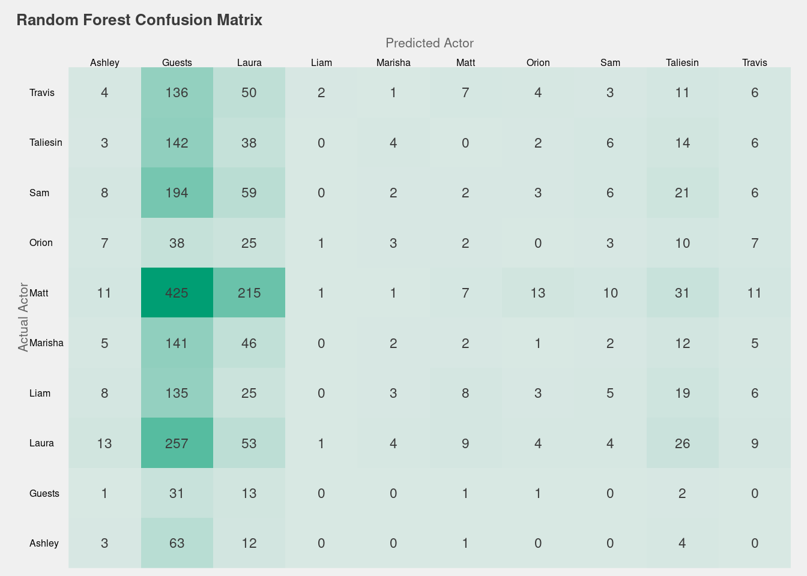
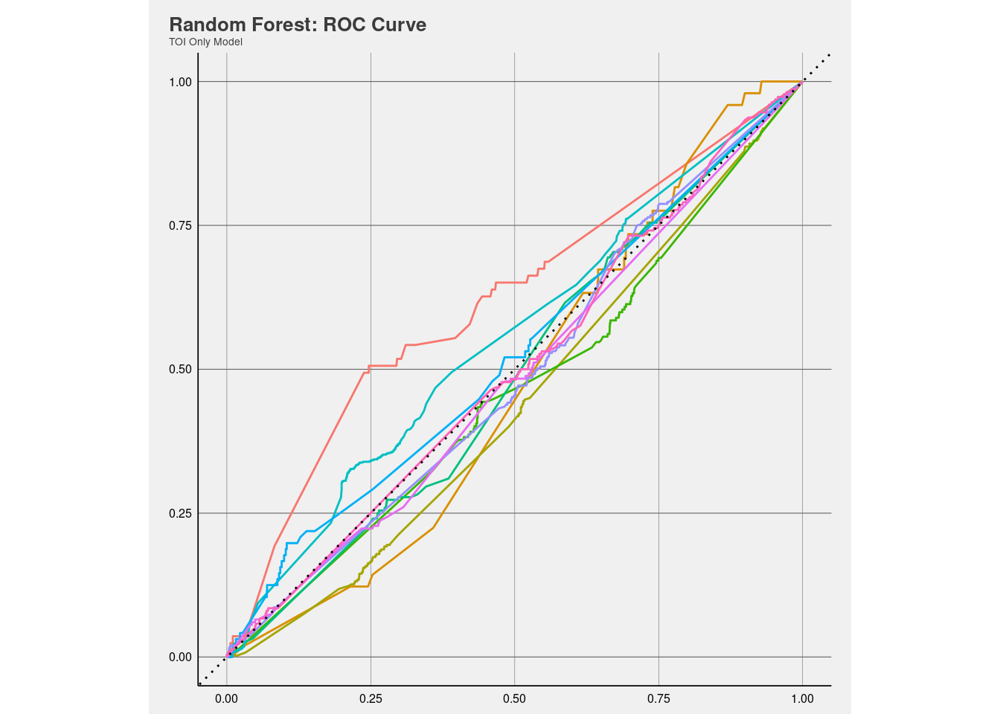
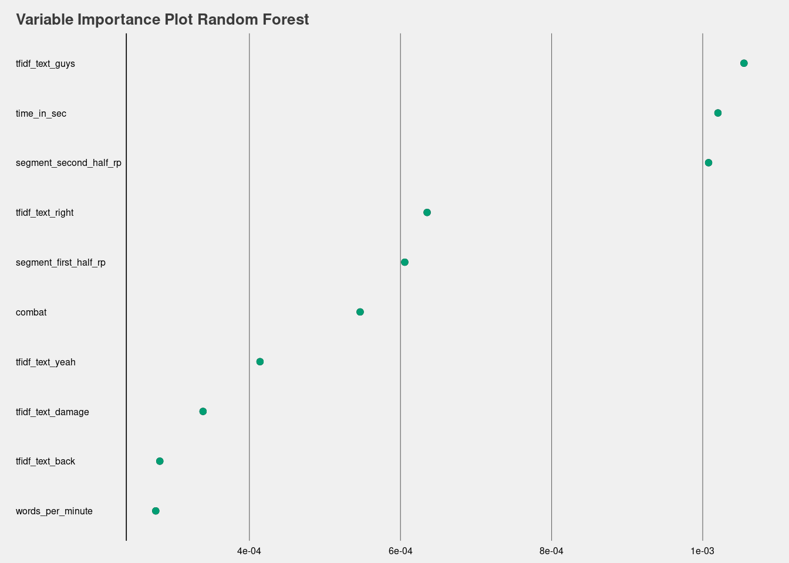

In the last post we investigated the critical role subtitles from season
one. During the analysis we have already seen that some words can
potentially tell us whether a certain segment is spoken by one of the
actors. Now, let’s see whether we can predict the speaker using the text
and more advanced methods. Predicting the label of a text is a common
task in machine learning and is used, for example, when deciding whether
an email is spam or not. However, in contrast to spam filters, we have
nine speakers (dungeon master, players and ‘guests’), instead of two
(spam or no spam), to choose from. In statistical jargon this is
referred to multiclass classification. Moreover, the improv elements of
the show is likely to make it harder to identify the speaker than spam
as the spoken content is likely to be similar between players. Let’s
explore different methods to see which one, if any, we can be use to
confidentially match text to actors.

We have already seen that the subtitles cover 431 hours of game play
over 115 episodes. This amounts to 280,000 turns, or classified samples,
which we can use to train an algorithm to predict the speaker from the
text. However, we cannot use all of the data to train our algorithms.
Instead we have to split them into what is called training and testing
data set. Why is that? As everybody, who took an exam where the
questions where known before hand, knows, the most efficient approach is
to learn all the answers by heart. While this helps us to ace the test,
it does not help us to answer questions, which we have not seen before.
In other words, our knowledge does not generalize well to similar
problems. The same is true for algorithms. Therefore we want to have a
final exam with questions the algorithm has not seen before to know how
well we did. However, we also need some of the course material to
practice the content. Thus, we have to split the data into two random
sets. We can then use one sets to train our algorithms and choose the
best algorithm (training set). Afterwards we use the other set (testing
set) to see, how well our favorite model generalizes to data it has not
seen - think of it like a final exam.

As we don’t know, which part of our training data represents our data
(or the unseen final exam) best, we can split the data into multiple
parts and train the model multiple times with each of the part
functioning as training and testing at different times. In the machine
learning jargon, those sets are called folds. This gives us a better
indication of how well an specification of an algorithm works. A common
practice and the one we will use is to use 10-fold to train the
algorithms. The image below pictures the process.

Yet, we face another problem when training the model. As we have seen
last time, not every actor was present for every episode. Orion was also
present for around 24 of the episode, while Ashley was only there for
54. Similarly, Matt spoke for much of the time compared to other members
of the cast. We need to account for this imbalance when estimating our
algorithms. As Matt spoke for 50 percent of the words and 28 percent of
the turns (samples), simply guessing Matt for every text would result in
being correct in a little more than one fourth cases. So every algorithm
that we train has to beat this benchmark to be considered an improvement
over simply guessing Matt all the time.

As our data is heavily imbalanced, we can also adjust it so we can
better predict speakers, who do not speak so much (like Ashley, Orion
and the guests). This will helps us to identify text spoken by them.
Doing so is called down sampling. However, this comes at the cost of
giving more weight to them than they should have given how a game of
Dungeons and Dragons is played. An episode of the show will almost
certainly include more speaking from the game master than the player as
everything has to be described and NPCs have to be played out. Hence, if
our goal would only be to identify the best prediction we would not down
sample. However, this would results in our model not really learning how
to predict Ashley, Orion or the guests. I feel predicting the text
should include all actors.

We could also increase the number of samples for the actor, who speak
less (up-sampling). To do so we would duplicate text from speakers, who
speak less. However, as we would to increase the number of turns for
many actors by a lot to have the same number of turns for each speaker
doing so would increase the time to train the algorithms by a lot. As
the models already take quite some time to train we down sample to save
time (I encourage, however, the interested reader to use up-sampling on
their own).

Similarly, we sometimes encounter that actors say the same thing at the
same time. However, this happens rarely and it’s even more rare for the
same two actors to say something at the same time multiple times through
out the series. We would also significantly increase the number of
classes we would need to predict to around 110 (all of combinations of
actors, who say something at the same time together during all the hours
of game play). Thus, we omit these cases from our analysis. Doing so, we
end up with 34,500 samples, which we can use to train our algorithms.

So far we have to dealt with the fact that the original data included
many speakers and an unequal amount of speech for each actor. Now, we
can turn to the question on how to model the data to be able to predict
the speaker. Recall, that our data looks as follows:

<table class="table" style="margin-left: auto; margin-right: auto;">
<thead>
<tr>
<th style="text-align:right;">
Episode
</th>
<th style="text-align:right;">
Start\_Turn
</th>
<th style="text-align:right;">
End\_Turn
</th>
<th style="text-align:left;">
Actor
</th>
<th style="text-align:left;">
Text
</th>
</tr>
</thead>
<tbody>
<tr>
<td style="text-align:right;">
100
</td>
<td style="text-align:right;">
0
</td>
<td style="text-align:right;">
6.503
</td>
<td style="text-align:left;">
Matt
</td>
<td style="text-align:left;">
hello everyone, and welcome to tonight’s episode of critical role, where
a bunch of us nerdy-ass voice actors sit around and play dungeons and
dragons.
</td>
</tr>
</tbody>
</table>

We can use this and include some additional information to ultimately
turn the data into something like this:

<table class="table" style="margin-left: auto; margin-right: auto;">
<thead>
<tr>
<th style="text-align:left;">
Actor
</th>
<th style="text-align:left;">
Text
</th>
<th style="text-align:right;">
Time in Sec
</th>
<th style="text-align:right;">
Words per Minute
</th>
<th style="text-align:left;">
Arc
</th>
<th style="text-align:left;">
Segment
</th>
<th style="text-align:right;">
Combat
</th>
</tr>
</thead>
<tbody>
<tr>
<td style="text-align:left;">
Matt
</td>
<td style="text-align:left;">
hello everyone, and welcome to tonight’s episode of critical role, where
a bunch of us nerdy-ass voice actors sit around and play dungeons and
dragons.
</td>
<td style="text-align:right;">
6.503
</td>
<td style="text-align:right;">
258.3423
</td>
<td style="text-align:left;">
End
</td>
<td style="text-align:left;">
Prologue
</td>
<td style="text-align:right;">
0
</td>
</tr>
</tbody>
</table>

Please note that we dropped the episode number from the data so the
algorithm does not train on episode specific dialogue, while keeping the
arc to allow for some general changes in the story to be represented in
the data.

So far we have not dealt with the spoken text. Lets do that now.
(tokenize)

-   Accuracy

-   KNN

    The first approach to classify the text, is to use an approach
    called <u>K-Nearest Neighbors</u>. The approach is simple. When we
    have to classify a text, we take the k number of nearest texts and
    take the class, which is most present within these texts. This may a
    bit unituitive when it comes to text. So let’s examine the duration
    a text was spoken over and the number of words as more clear cut
    example. The graph below plots some imginary data for two speakers:
    Matt and Laura. When we have to assign a speaker to a new text (the
    black point in the graph below), we choose the speaker, which is the
    nearest. As the nearest point is classified as ‘Matt’, we classify
    the new text as Matt as well. In the end the best model for our
    training data contains X neigbors and has a fit of Y.

    

    While K-nearest Neigbor is fast to train. Fitting the data takes
    long time. Additionally, we dont know the importance of features(?).
    Alternative aproach: “<u>Naive Bayes</u>”. The approach is often
    used in spam classification tasks and hence may be prone to be used
    a classification task with text. The main idea is to calculate the
    probability that a given text is one of the classes (in our case one
    of the actors), given the words in the text. Additionally it
    includes the probabilty that a text is a given class in general. The
    class with the highest score is then chosen to be the predicated
    class. For example, the text may look as follows:

    > Hello, everyone and good evening.

    Naive Bayes then calculates the probabilty that the text is spoken
    by a certain actor, taking the probabilty that a given text is
    spoken by Matt (XXX) and then mulitplies the by the probability that
    the text is spoken by Matt given the words in the text. The actor
    with the highest values is then chosen as the predicted class. Note
    that the word order is irrelevant for this approach and all words
    and other features are equally important.WHAT ARE THE TUNEING
    PARAMETERS????)

    <table>
    <colgroup>
    <col style="width: 5%" />
    <col style="width: 94%" />
    </colgroup>
    <thead>
    <tr class="header">
    <th>smoothness</th>
    <th>An non-negative number representing the the relative smoothness of the class boundary. Smaller examples result in model flexible boundaries and larger values generate class boundaries that are less adaptable</th>
    </tr>
    </thead>
    <tbody>
    <tr class="odd">
    <td>Laplace</td>
    <td>A non-negative value for the Laplace correction to smoothing 
    low-frequency counts.</td>
    </tr>
    <tr class="even">
    <td></td>
    <td>DO YOU HAVE TO BIN THE DATA, WHICH IS NUMERIC???</td>
    </tr>
    </tbody>
    </table>

    Assumption of equally important and independent features rarely true
    -&gt; alternative next model

    So far, we have examined models, which have nice statistical
    properties but do not allow us for intutive interpretation. Wouldn’t
    it be nice to have simple if then rules, which can be read without
    knowing all the mathematical sheneigans? This is what decision trees
    are for.

-   naive Bayes

-   Naive Bayes

-   Regression (regularized)

-   Random Forest

-   XGBoost

-   SVM

-   up-sample

-   just random sample

-   essemble

