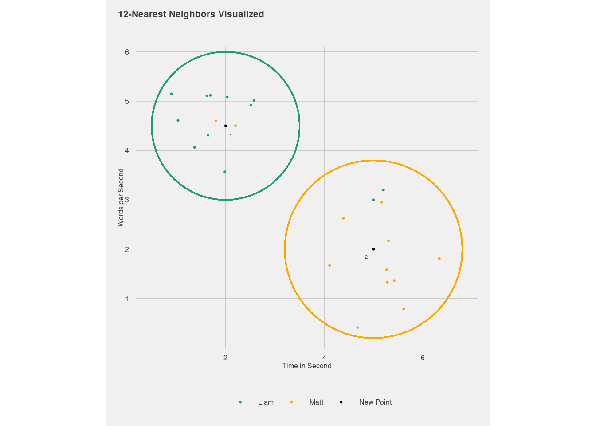
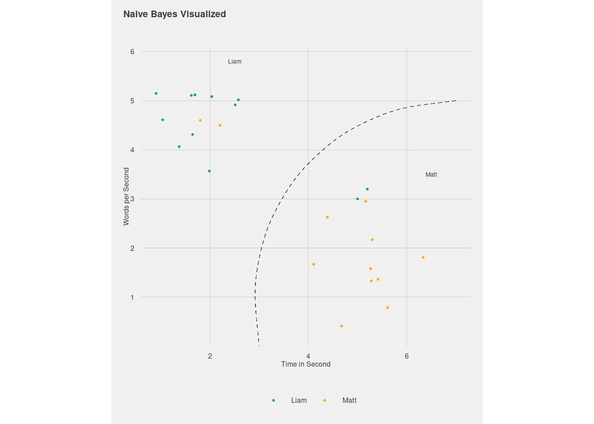
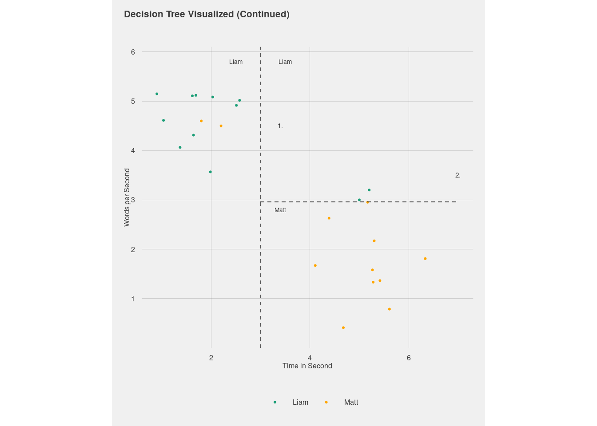
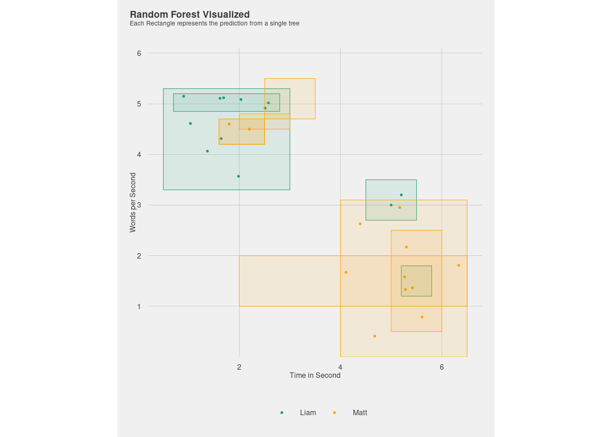
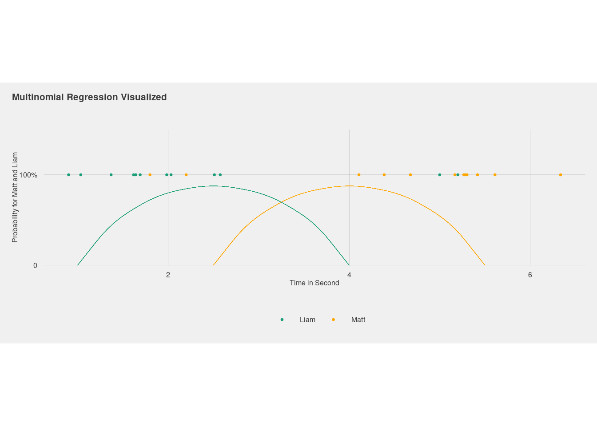
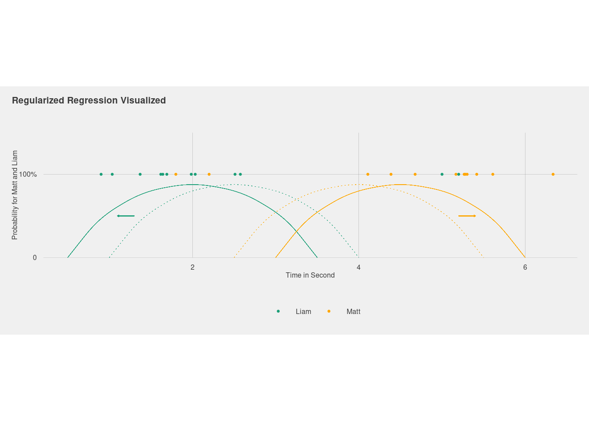
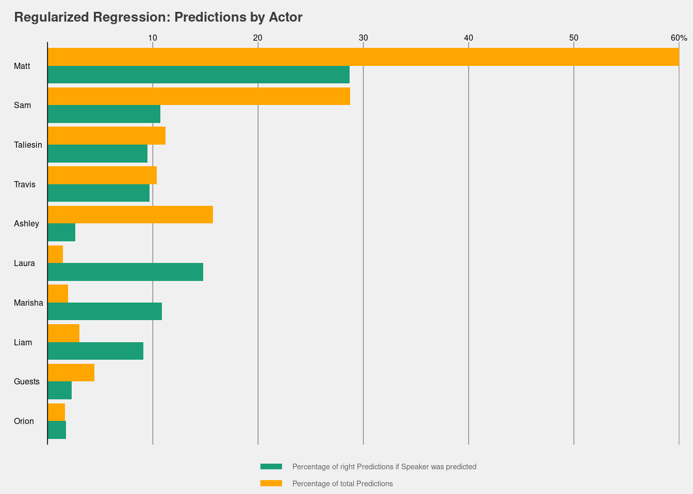
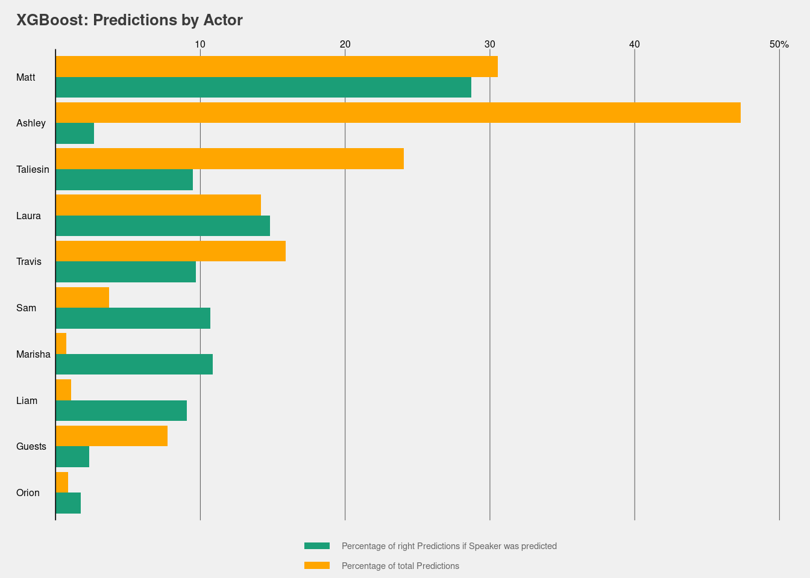

# Introduction

In the last post, we discussed how we prepared the Critical Role
subtitle data to predict the actor from the spoken text. First, we split
the data into training and testing data sets. Second, given the
imbalance of the data, we down-sampled the data. Third, to achieve
results in reasonable time, we decided to only include the 300 most
predictive words using ‘term frequency inverse document frequency’. In
this post we discuss different machine learning algorithms, which are
available to and see well they can predict the speakers from the text.

## K-Nearest Neighbors

The first approach we can use to try to predict the speakers is called
‘k-nearest neighbors’. As the name suggests, the algorithm classifies
samples by examining the k nearest texts and take the speaker, which is
most present within these texts. This may a bit unintuitive when it
comes to text. So instead we can examine the time duration of a text and
the number of words it contain as a more illustrative example. The graph
below plots some imaginary data for two speakers: Matt and Liam. When we
have to assign a speaker to a new text (the black point in the graph
below), the algorithm chooses the speaker, which is occurs most within
the k nearest points. For point one, this means that the point is
classified as ‘Liam’ as more similar points belong to Liam compared to
Matt. For point two, the opposite applies.

This approach is rather straight forward, however the question arises:
which moving parts does the algorithm adjust during training? On the one
hand, it has to find optimal the number of neighbors it considers for
prediction. For the upper left cluster of points, we can see two points,
which belong to Matt. By only considering the nearest two neighbors, we
would alter our prediction for point one to Matt. Still, only
considering the nearest two points might increase the chance that our
results are driven by chance. As we can see, all other points apart from
the two nearest belong to Liam. In the training process, the k-nearest
algorithm needs to find the optimal number of neighbors to rightly
assign the highest number of texts to the right speaker.

The example above highlights one of the key trade offs in machine
learning. When the k-nearest-neighbor-algorithm defines the number of
neighbors too narrow, its predictions may not generalize well to unseen
points. If that’s the case it would be better to increase the number of
points. However, there might indeed many cases in which Matt says the
same thing really fast in a short amount of time. Something like ‘What
would you like to do?’, comes to mind. Thus choosing the right amount of
neighbors to consider is a case for the bias variance trade off, which
is present in all machine learning models.

On the one hand, if an algorithm focuses too little on the patterns in
its training data, it oversimplifies the model and does not pick up
relevant features for our speakers (bias). For the case above, this
could mean that we look at the nearest 24 points. This would mean that
the algorithm fails to distinguish between the two groups of points. On
the other, if an algorithm focuses too much on it’s training data, its
predictions overfit to the training data. This results in bad
predictions for new points, which may be different from the points in
the training data (variance). For the case above, this could mean only
focusing on the two nearest points and thereby omitting the big picture
of the two separate cluster of points. To make a decision on which
number of neighbors is best, we let the algorithms chose the one, which
maximizes the number of rightly classified texts.

Another parameter, which the k-nearest neighbors searches it best
configuration for, is the weighting function. The weighting function
determines how the distance between points is calculated. In the example
above, we used the direct distance between points to classify them as
neighbors. However, other functions are possible. Luckily, we can also
use the computer to determine which method works best for our data.

Taken together, the final model uses 13-neighbors to make its
prediction. To define the nearest neighbors, the algorithm uses an
inverse distance function. The function gives less weight to points the
further away they are from our new point. However, the total accuracy of
the model is not really high (0.119). This means we only the right
speaker to the texts in 12 percent of the cases. As we have seen in our
last blog post, the number of texts from Matt is already 28.4 percent.
Thus, our model did not help us predict the speaker, and we would be
better off predicting Matt for all spoken text.

Additionally, there are two disadvantages to using the
k-nearest-neighbors algorithm. First, while the algorithm is fast to
train, it takes long to make predictions. Second, the algorithm does not
tell us what features of a text makes the model think that it was spoken
by a certain actor. Taken together, the results were not satisfactory
and do not yield easily interpretable results. So let’s turn to another
model to see if it can help us to predict the actors of Critical Role.

## Naive Bayes

One algorithm often used in spam classification is called Naive Bayes.
Its main idea is to calculate the probability that a given text belongs
to a class (in our case one of the actors), given the words in the text.
Simultaneously, it includes the probability that a text is a given class
in general (think of the 28.4 percent of texts from Matt, we have seen
in the previous post). The class with the highest score is then chosen
to be the predicated class. Lets put some flesh on the theoretical bones
and look at an example:

> Hello, everyone and good evening to tonight’s episode of Critical
> Role.

Naive Bayes calculates the probability that the text is spoken by a
certain actor for each actor. Recall, that we have ten actors and have
down sampled the data, so each actor covers twenty percent of the
training data. Thus, the algorithm starts with the probability for each
actor of 20 percent. It then adds or subtracts the probability for each
actor given the words in the text, depending on how likely the actors
are to use certain words. For this particular case, the phrase,
‘tonight’s episode of Critical Role’ is unlikely to be said by any other
than Matt. Hence, the algorithm should assign the highest probability to
him and predict that the text is spoken by him.

To achieve its prediction, the Naive Bayes algorithm makes the
assumption of independent features. Intuitively, you can think of this
as assuming that all words are equally important. While this assumption
is often unreasonable, it widely used in text classification. Recall,
however, that we only include the 300 predictive words instead of the
full sentences. Moreover, it is also not ideal to have numeric features
like the speed talking in the analysis. However, in the interest of
comparability, we leave these features as we have done so far. If Naive
Bayes yields best predictions, or at least close to the best, we can
still rerun it with a better specification.

The Naive Bayes algorithm has two tuning parameters, which is needs to
configure during training. On the one hand, it needs to adjust cases,
which happen relatively rarely. The reason for this is the fact that
when some features only rarely happen or never for some classes, will
result in probabilities of zeros and ones. As it does not seem realistic
that a text is not spoken by a certain actor with 100 percent certainty,
the counts of these low-frequency words need to be adjusted. To do so,
the algorithm adds a small number to all features to ensure non-zero
probabilities. As we don’t know how big this small number should be, we
can let the algorithm decide the number of itself.

On the other hand, the computer needs to decide how smooth class
boundaries should be. What does that mean? In contrast to k-nearest
neighbors, our boundaries for the predictions can be smooth (see picture
below). The smoothness of the boundaries influences the predictions. If
we make the boundaries too smooth, we can exclude the two points for
Liam bottom right cluster and include them in the Matt group. However,
as we don’t know whether this helps our overall predictions, we let the
computer tune it for us.

In our final model, the computer decided to have a smoothness of 1.211
and add 2.88 to the count of features. The later means that 2.88 is
added to the count of our 318 features. The former tells us how smooth
the boundaries are, however, they are not easily interpretable. Taken
together, our Naive Bayes model only achieves an accuracy of 0.03. This
means it only predicts the right speaker in three percent of cases. This
in a decrease compared to the nearest neighbor model and simply guessing
Matt for every text is still the best approach.

Moreover, neither of the two models we examined so far allow us for
intuitive interpretation. Wouldn’t it be nice to have simple if-then
rules, which can be read without knowing all the mathematical
shenanigans? This is what decision trees are for. They are used, for
example, by banks to be able to explain to clients why they didn’t get a
credit. So let’s build a decision tree to see if they are better at
predicting the speakers and to see which features are relevant for the
predictions.

## Decision Tree

The most illustrative example of a machine learning model is a decision
tree. The idea is simple: in the end when want to have number of if-then
statement, which guide us to our prediction. Let’s look at how this
would look like for our example for differentiating between Matt and
Liam. In very simple terms we could make the simple rule to say: if the
duration of a text is longer than three seconds, we classify it as
spoken by ‘Matt’. If it is shorter than three seconds we classify it as
‘Liam’. Applying this simple rule, we only miss classify the two familar
points in each cluster.

However, the decision tree can come up with the more nuanced rules. In
first step, it could decide on our rule. In the second step it could
say, ‘and if a text is longer than three seconds but also is spoken at
three words per seconds or faster, also predict ’Liam’. The picture
below visualizes the rule. This is way more illustrative than we two
models we have used previously.

So how does a decision tree come up with the final model. The idea to
split our data in various steps, to narrow it down so far that we can
make predictions. To decide on which variable to split first, the tree
test, which split would help us best to differentiate between classes.
So in the example the algorithm would check, whether splitting at a
duration of 1 seconds, 2 seconds etc. Similarly, it would check whether
words per seconds would be a good split. As we can see, splitting at
words per seconds of three is actually better than splitting at number
of words as we rightly classify two texts from Liam, which we attributed
to Matt previously. Thus, the first split from the tree would be at a
talking speed of three words per second.

In the next step, the algorithm would ask whether it can further split
the sample to make better predictions. If we look at the graph our
immediate response might be to say yes. We could split the data such
that we make the right predictions for two points of Matt, while miss
classifying one point of Liam. This would increase our overall accuracy
(see below). However, what if the two points are the only two occurrence
of these combinations of values for Matt? If this was the case, we could
potentially miss classify many text, which belong to Liam. We would
over-fit the data. To prevent this we can tell the algorithm that we
don’t want too complex trees (meaning to many splits) in our model. We
do this by adding a complexity penalty to our algorithm. Doing so,
results in our algorithm not preferring too complex models over simpler
models, which do only a sightly worse predicting our speakers.

So how do we decide, when to stop dividing the points? There are two
major decision number on when to stop splitting the data further. On the
one hand, we could say, that the number of points we need to have in
each bucket should be at least a certain number. In our case we might
say that making a prediction based on three points is too uncertain for
our liking. One the other hand, we could say that we only like to split
our data into so many different buckets. As we don’t know before hand
how our data looks like we will let your research assistant, the
decision tree algorithm, come up what they think is best to generalize
to unseen data.

In our final model, the algorithm decided on a tree that is 7 splits
long. Moreover, it decided that there 11 is the minimum of points in
each quadrant, to consider further splits. In order to reach the final
tree a penalty for each split was induced of 4.43 wrongly classified
speakers. This all sounds pretty theoretical so how does this look in
practice? Unfortunately, a tree with seven decisions is too big to be
shown here (but is available in github). However, we can look at one
case to illustrate the idea. The first question the decision tree
algorithm asks when it sees a new data point is whether the text has
more than 133 characters. If that is the case, then we examines whether
there are less than 248 lower characters in the text. If that is the
case and the text contains the words, ‘know’, ‘going’, ‘use’ and ‘oh’ it
asks whether the text contains the word ‘just’. If it does not than it
predicts Matt. If it does, the algorithm predicts Sam (right
interpretation tfidf?). Hence, the two (hypothetical) sentences would
result in the following predictions:

<table>
<tbody>
<tr class="odd">
<td>Text</td>
<td>Prediction</td>
</tr>
<tr class="even">
<td>You know what? It is going to use its ability on you.</td>
<td>Matt</td>
</tr>
<tr class="odd">
<td>You know what? I am just going to use bardic inspiration on myself.</td>
<td>Sam</td>
</tr>
</tbody>
</table>

This rule seems overly simplistic. However, other rules contain more
text specific features like the number of periods in a text. But those
do not illustrate the difference in prediction as nicely. So how does
the algorithm do? In total it rightly assigns 20.7% of our texts to the
right speaker. This is a big improvement over the Naive Bayes approach
or also beats our prediction using k-Nearest Neighbors. However, it is
still worse than predicting only Matt for all our classes. So can we do
better?

# 8. Random Forest - Prediction + chosen Parameters

A further development of decision trees are random forests. The idea is
to build many decision trees randomly (hence the name). In the first
step, the algorithm randomly selects data from our training data (a
process called bagging). The data is bootstrapped, meaning that each
point can be chosen more than once. Next, the algorithm builds a
decision tree but only chooses two random variable as candidates for the
splits. For the next split, the algorithm again chooses two random
variables and reaches a decision. It does so until the tree is finished.
We then build many of these decisions trees to make our forest. To make
our predictions, we let all our individual trees cast a vote on which
prediction to make. The actor with the most votes is our prediction for
this text. To evaluate the random forest we would use the texts not
randomly selected into the new data set to obtain the accuracy of the
random forest.

As the procedure is a bit abstract, let’s talk about what at would mean
for our case. In the first step, we build our new data set, which can
contain multiple of the same dialogue. Next we start to build our first
tree. So we randomly select two variables, between which we have to
decide. Let’s say we randomly selected the number of characters in a
text and whether or not a text happens during combat. As we have seen in
the previous section, we might come to the conclusion that the number of
characters does better help us for deciding on the actor than knowing
that a speech happens during combat. However, given that we have a new
data set, this does not necessarily have to be the case. So after
deciding, which split helps us better predicting the speaker, we split
the data accordingly. Next, we again chose two random variables. Now, we
have to decide whether the words per minute or the number or of commas
in a text help us better for the prediction. This is likely not be a
clear cut compared to the previous step as we also do not use the full
training data. Let’s assume we decide to split using the talking speed.
We then would split the data accordingly. We continue with this process
until the number in each leaf is smaller than a certain number and the
decision tree is done. Afterwards we build many of these decision trees
and let them vote to obtain our predictions.

Like in the decision tree, we can let the computer decide on the number
of trees and the minimum number of data required to further splitting.
Additionally, we let the computer decide between how many variables the
random forest can choose between. This leaves us with three tuning
parameters. As we have over 300 variables to chose from, the decision on
which combinations of these values is our best bet for making our
predictions, the training takes a really long time.

*self-derived think about again:* How could we think about the process
graphically? One way to think about this algorithm is that we build many
small boxes in which our data points are contained in. How does that
potentially help with the results? In contrast to decision trees we
cannot easily say why we decided on a certain actor and not somebody
else. However, decision trees are really sensitive to the data. For
example, what would happen if we sample only texts in which Matt speaks
quickly? We would associate this feature with Matt, even though this
would not necessarily be the case. If this were the case, a decision
tree would base a lot of it predictions on this feature. This is
especially true, if different variables are correlated (<u>why?</u>).
For example, the number of words in a text and duration over which it is
spoken is likely to be correlated (correlation coefficient XXX). WHY
BAD? The random forest is built using random data and random variables.
Thus, they the individual trees are less likely to be driven by a high
correlation between these two features. Hence, if the predictions by
some trees may be driven by correlation, given that we calculate many
more trees, we don’t give their vote much say. Thus, we are more
protected against the errors of the individual trees.

So what what does the computer decide upon and how did it do? In the
final model, 1790 trees are used to make the predictions. At each split,
52 random variables are sampled to make a decision between. The
splitting stops when there are 19 or fewer texts within a split.
Predicting our test data set, the model only manage to get 21.5 percent
of cases right. Again, we would do better by just predicting Matt for
all texts.

# 9. XGBoost

Another approach for increasing the performance of decision trees are
extremely boosted trees. They specifically designed for large data sets,
so they might do a better job than our previous models. The idea is to
improve the performance of the forest (an ensemble of trees) towards
better prediction continuously instead of only randomly. In the first
step, we make an initial prediction (say each class is similarly likely,
meaning a probability of 20%). Afterwards we build a decision tree that
minimizes the differences between our initial guess and the actual
probability for each actor (0 or 1 as each text is spoken by one actor).
Afterwards we build a new tree using our predicted probability for each
point so far on as our initial guess. We continue doing so until, we
computers says it can no longer improve the results. Intuitively you can
think of this algorithm as adding trees to a forest, where each new tree
tries to help our prediction by predicting parts, which were previously
unaccounted for by the forest. Graphically, the result would look
similar to the random forest.

How exactly this trees looks (how many predictors are randomly compared,
how big the individual trees are and how many trees are built etc.), we
leave again for the computer to decide. In our case, the computer
decided that at each step 9(?) random variables are compared against
each other and 70%(?) of the data is randomly sampled. Second, that the
minimum number required for further splits is 29(?) texts. Additionally,
our loss function needs to decrease by 0.00005(?) to allow for the split
even if 29 or less texts are in a leaf. Last, our model contains XXX
trees and the the weight given to the prediction of each of these trees
is 0.9(?).

Lets see how our new model does. In total our new model only predicts
with an accuracy of 0.185.

# 10. (Regularized) Regression - Line graphs

So far, the models failed to tell us the effect of certain
characteristics on the probability of predicting a certain speaker. For
example, we might be interested in how much does an increased talking
speed influence our prediction that a text is spoken by a certain actor?
Although, the decision tree gives us a good indication, which features
of a text matter for prediction, we might still be interested in the
exact influence. One way to estimate these effects, is to use a more
simple model called OLS. The model estimates the effect of different
variables on the probability of different speakers as follows:

EXPLAIN LINEAR MODEL MORE CLEARLY

*S**p**e**a**k**e**r**n* = *β*0 + *β*1(*w**o**r**d**s* *p**e**r* *s**e**c**o**n**d*)

where speaker\_n is the speaker we’re predicting and the the beta are
the effects of the different variable on the probability that the text
belong to a speaker. If we plug the numbers in for each speaker, we
chose the one with the highest probability. Using this we can estimate
the effect of the characteristics of the text on probability that the
text is spoken by certain actors. Under certain assumptions, we can be
certain that the estimated effect is unbiased effect. For example, the
model gives us that a text, which contains the word “you”, has increases
the probability that the text is spoken by Matt by XXX percent.
Likewise, if the text contains the word “you”, the likelihood for Liam
increases by ZZZ. However, the model is not very good at predictions.
Once our model is trained we only predict YYY% of speakers correctly.
The reason for this is the fact that the regression over fits by
construction as it is more aimed at parameter estimation compared to
prediction. What this means is that when we look at different subsets of
the data, we may get really different values out of our estimation.
Thus, our success at predicting speakers will vary quite a lot depending
on the subset our estimator was constructed on. What we can do instead
is a add some bias to the estimation to increase our predictive power.
However, once we do so we can no longer interpret the numbers as X
increases the chance of Z by V%. Still, it will increase our predictive
power.

The idea is to add some regularizing terms to our regression, as
follows:

*S**p**e**a**k**e**r**n* = *β*0 + *β*1(*w**o**r**d**s* *p**e**r* *s**e**c**o**n**d*) + *λ*(∑*α**β*)

where the best form of how the extra parameters enters can found out by
the computer. Our final model chooses a lambda of 1.45. We manage to
rightfully predict 0.236 of all speakers, which is best we have managed
as of yet. This is still worse than only predicting Matt for all cases.
So let’s try one last model to see if we can make it work out of the
box.

# 12. Investigate two Best Models: Variable Importance and Confusion Matrix

-   Random forest and SVM: take really long time

-   decision tree: would be really big and does add much -&gt; take an
    improvement from it

    -   -&gt; designed for large data sets: Maybe not large enough? (Use
        argument later for tuning with number of words)

-   compare regularized regression and XGBoost

-   Table -&gt; combine fit\_model.csv into df -&gt; add Matt -&gt; into
    line graph with Model on y axis and accruacy on x-axis

<table class="table" style="margin-left: auto; margin-right: auto;">
<thead>
<tr>
<th style="text-align:left;">
Model
</th>
<th style="text-align:right;">
Accuracy
</th>
</tr>
</thead>
<tbody>
<tr>
<td style="text-align:left;">
Guessing Matt
</td>
<td style="text-align:right;">
0.2842054
</td>
</tr>
<tr>
<td style="text-align:left;">
Regularized Regression
</td>
<td style="text-align:right;">
0.2362055
</td>
</tr>
<tr>
<td style="text-align:left;">
Random Forest
</td>
<td style="text-align:right;">
0.2154911
</td>
</tr>
<tr>
<td style="text-align:left;">
Decision Tree
</td>
<td style="text-align:right;">
0.2075088
</td>
</tr>
<tr>
<td style="text-align:left;">
XGboost
</td>
<td style="text-align:right;">
0.1848974
</td>
</tr>
<tr>
<td style="text-align:left;">
K-nearest Neighbors
</td>
<td style="text-align:right;">
0.1188084
</td>
</tr>
<tr>
<td style="text-align:left;">
Naive Bayes
</td>
<td style="text-align:right;">
0.0278621
</td>
</tr>
</tbody>
</table>

-   We see that regularized model does a really good job predicting Matt
    (0.729649855 of total right predicting), even though
    regularized\[Matt\] nearly equal to sum(xgboost)

-   More diversified = better (0.593483257 of all right predictions =
    Matt)

# 13. Conclusion

-   Naive bayes not ideally configured -&gt; should be done in the
    future
