# Critical Graphs: Some Shenanigans with Critical Role Season 1 subtitles and other data

“\[…\] It’s your turn to roll.” It’s with that phrase that many of the
episodes of Critical Role start. What is Critical Role you ask? To use
their words: It’s a bunch of nerdy ass voice actors, who sit around and
play dungeons and dragons. And they are successful at that. Thousands
around the world tune in to watch them live and millions view their
shenanigans on Youtube. What makes it unique is that nothing is
scripted. There is nobody writing out an episode beforehand. Everything
is possible and only happens in the imagination of the players and the
viewers. Whatever happens is up to the players and dice rolls to decide.
That’s what makes it so intriguing to watch. It also makes it
interesting for some nerdy ass data analyses. So lets do these here. But
be aware: spoilers ahead.

The first question for every data analysis is the question of which data
to use. Luckily, the community provided subtitles for every episode of
the first season. These can be used to create the data. For example, a
typical episode might start with the game master Metthew Mercer saying:
“Hello everybody and good evening. Welcome to Critical Role \[…\]”. In
the subtitle file this looks as follows:

> 00:00:00,500 –&gt; 00:00:04,043 MATT: Hello, everyone and good
> evening. Welcome to Critical Role, a show where a bunch of us

Where the numbers indicate the time a subtitle is shown on the screen.
Doing some data manipulation this can be turned this into some nicer
format. At this point I should mention that I am not the first to create
a data set using the data. Rameshkumar and Bailey (2020) used the data
in a published paper already. However, while it includes some additional
information compared to my data set, it omits the time dimension of the
data. Also creating my own data set served as a good practice in data
cleaning for myself.

As the subtitles were written by volunteers, not everybody followed the
same naming convention for the person speaking. For example, if the game
master is speaking as an NPC, this could be written in the subtitles as
the name of the NPC or as Matt. Additionally, as is inevitable when
typing out such a lengthy and quickly spoken text, people make mistakes.
Which brings us to the first interesting question to ask: which actor
got misspelled the most in the subtitles?

The person, who got miss spelled the most was Marisha Ray. These
include, for example, Marishaia or Marishaaaa.

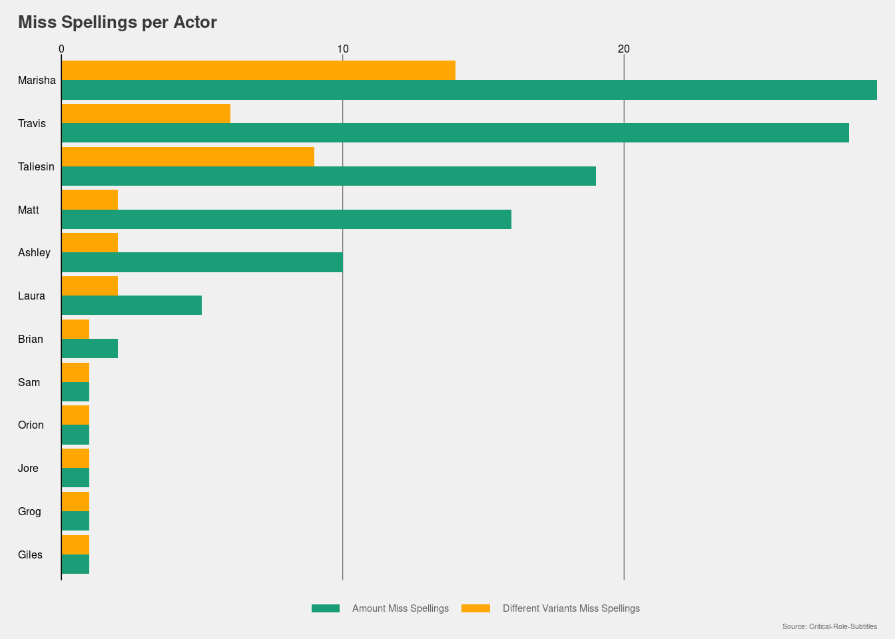

However, not everybody has the same chance to be misspelled. The direct
comparison may be unfair for two reasons: first, not every actor was
present for all episodes. Second, not every actor spoke for the same
amount of time. While Matt, as the game master has to be present for
every episode and has to describe elaborate scenery, other actors can be
give short answers or sit out an episode. So let’s look of both of these
numbers in turn.

Looking at the attendance by the players some difference become
apparent. First of all, it becomes obvious that most players are also
present most of the time. Out of the eight players, five didn’t miss
more than 5 episodes. Additionally, Sam Riegel only missed 9. Meanwhile,
Ashley Johnson didn’t even attend half of the episodes. Likewise, Orion
Acaba did only participate in every fifth episode. The main reason for
the absence of the latter is the fact that he dropped out of the project
after only a little more than 25 episodes were filmed. Hence, it seems
reasonable that both Ashley and Orion got misspelled less compared to
the rest of the cast. Additionally, it shows that about one in five
episodes had guests joining the show.

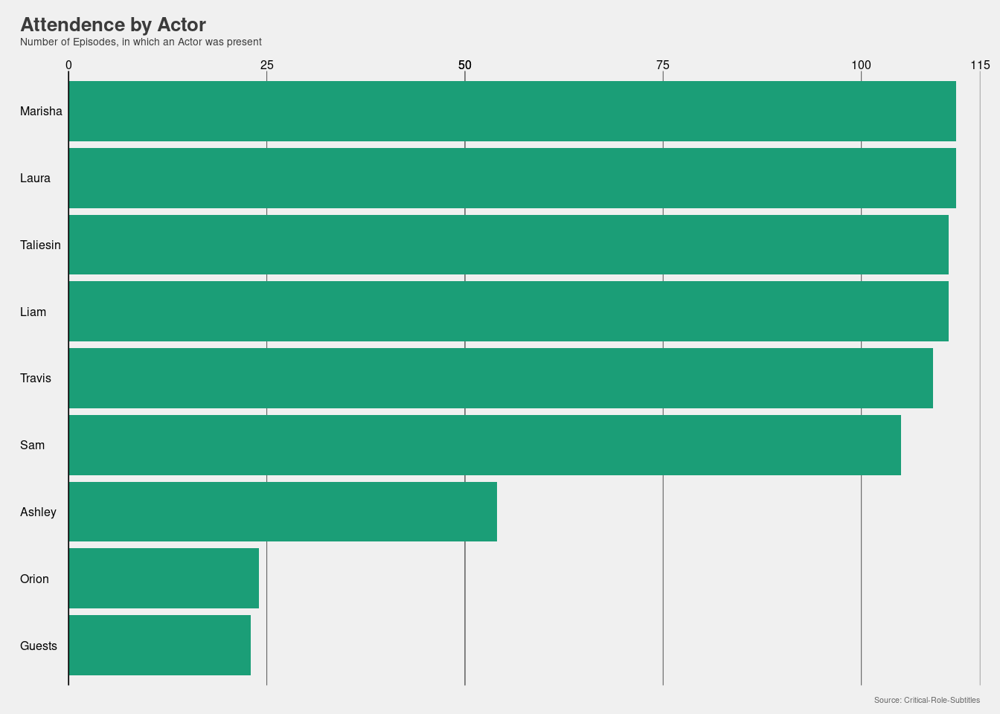

Let’s look at the time different actor speak. Looking at the data, it
becomes obvious that Matt speaks the most. This hardly is surprising.
After all, a game master has to describe how everything looks and feels.
Additionally, he has to act out non player characters and their reaction
to the actions of the players. Lastly, he has to describe how the
actions of the players are playing out in the imaginary world. In total
he speaks three quarters of the time and uses fifty percent of all words
spoken. Similarly to the misspellings, Marisha tops list in terms of
time speaking. However, in terms of words spoken Laura Bailey jumps
indicating that she speaks quicker compared to the rest of the cast.
Moreover, it becomes obvious that both Ashley and Orion speak around the
same amount as all guests of the show combined. However, there is a
catch to these numbers. Namely, that not all everything that is said is
transcribed in the subtitles. Sometimes many people speak at the same
time. In that case not everything is recorded in the subtitles.
Moreover, the time people speak can only be seen as a rough estimates.
The reason for this is is the fact that it is measured by the time
segments of the subtitles are shown. For example, a long description
from Matt may span over 30 seconds. These 30 seconds may be split into 5
subtitle segments, which do not incorporate pauses. Additionally,
descriptions like “(everybody is laughing)” are dropped and not
investigated as spoken text. In total there were roughly 3.7 million
words said. This corresponds to 475 hours of conversation or around four
hours per episode.

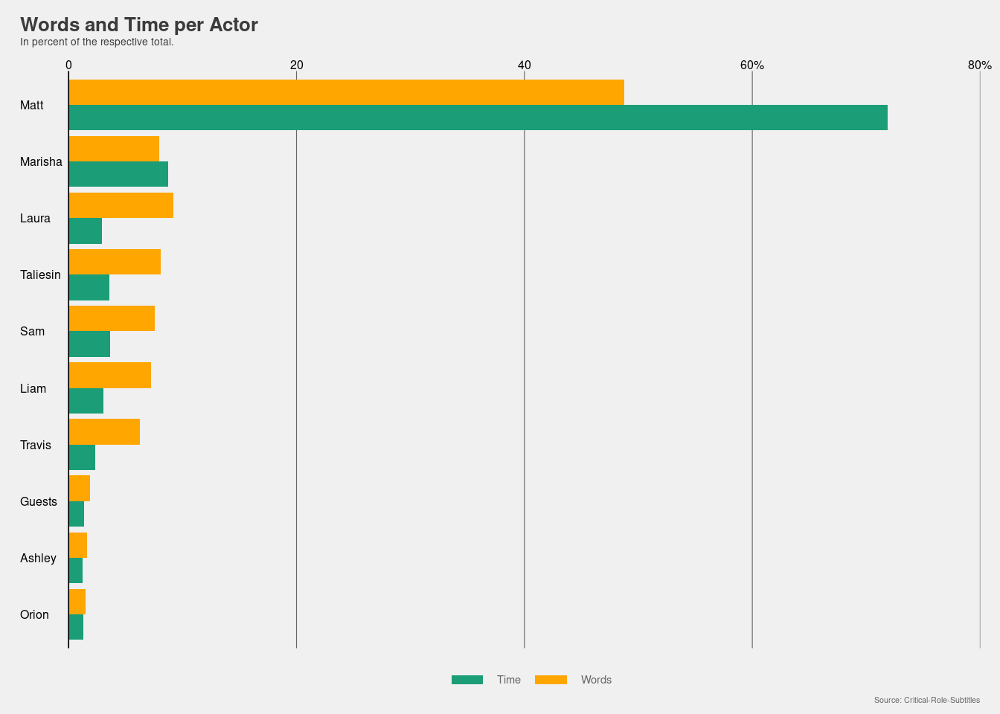

Yet, we can still look at the most used words per actors to see if there
some distinct words by the actors. There some differences become
obvious. For example, the by now iconic “okay” used by Ashley can also
be found in the data. Additionally, most players use words like going to
indicate the actions that they like to do.

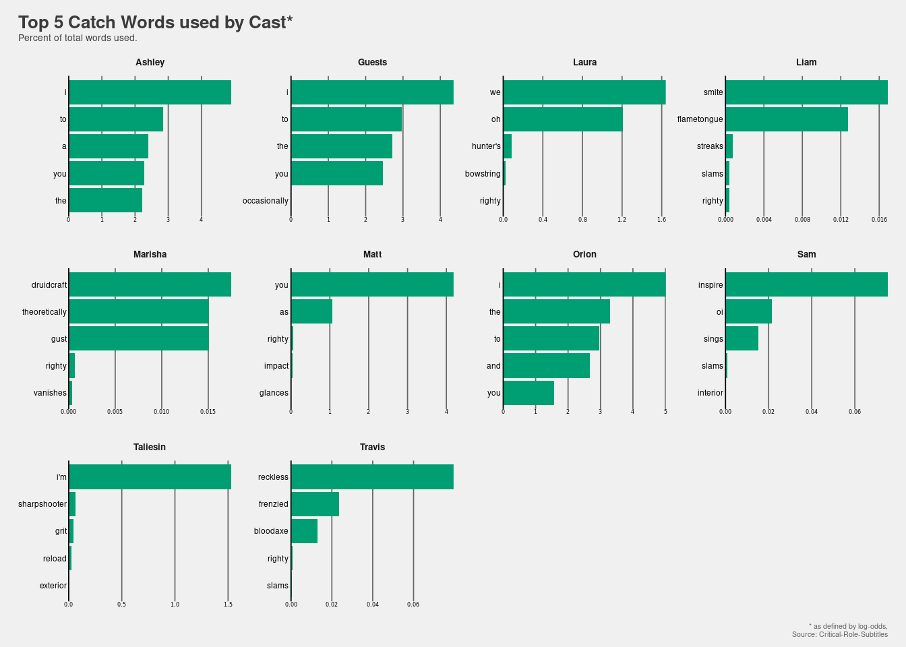

Differences in words used between the cast members became obvious. We
can use this to see, which cast member used the most elaborate
vocabulary. Using an grade reading level index we can quantify this. As
expected, Matt uses the most elaborate vocabulary. Additionally, one
might argue that the vocabulary used correlates with the intelligence of
the character played. However, Grog (played by Travis Willingham) seems
to be the exception to the rule. While being the dumbest member of Vox
Machina (as the characters call themselves), Pike (played by Ashley)
seems to be using less expensive vocabulary. This may, however, be an
artifact of the fact that Ashley is less present and Pike as a character
rather shy. Hence, the low grade level.

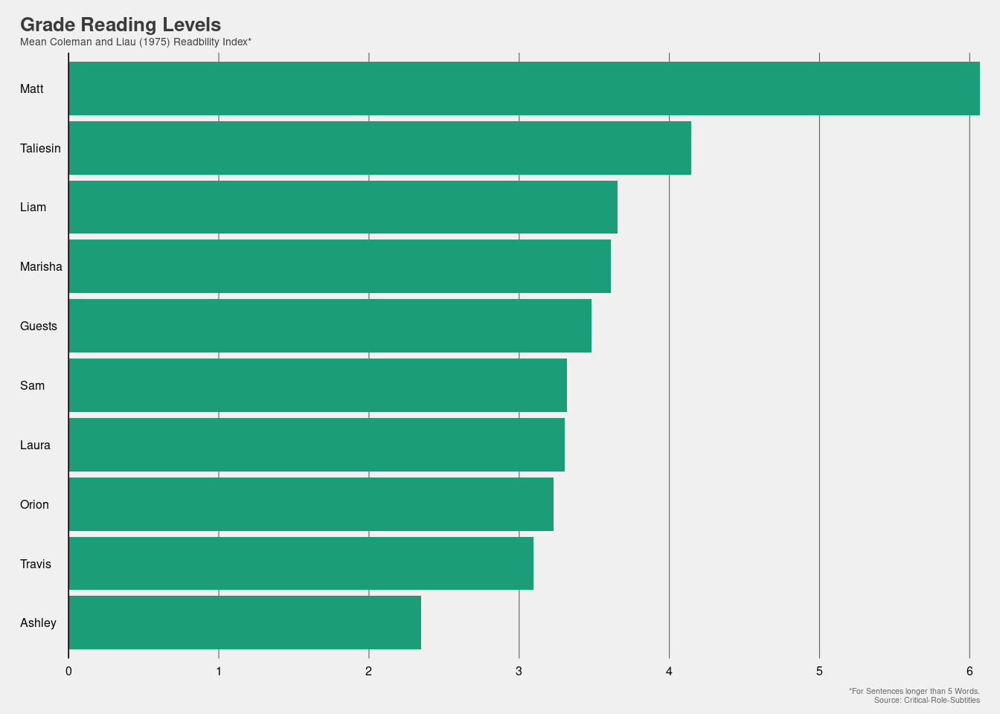

As Pike and Grog are best buddies it seems to be only fitting to look at
the interaction between cast members. Indeed the second most character
Ashley interacts with is Travis. He is only second to Laura, who has the
most interactions with everybody. This indicates the findings from
earlier, where Laura speaks shorter remarks compared to the rest. Indeed
on average a segment from her only contains X words. The fact that
Ashley sits next to Travis and Laura indicate that people sitting next
to each other are more likely to interact with each other, as can be
seen by the prevalence of interaction between Marisha and Taliesin.
Moreover, in game relationship between characters become apparent to
some extend. Liam interacts most with with his in game sister played by
Laura and his love interest played by Marisha. Likewise, Taliesin
interacts most with his in game love interest Laura. Again, similar to
the analyses before there are some caveats to the results presented
here. Interactions as presented in the graph are measure by when actors
speak after each other. So they only give a rough estimate and actors
giving one line off character comments may inflate the results.

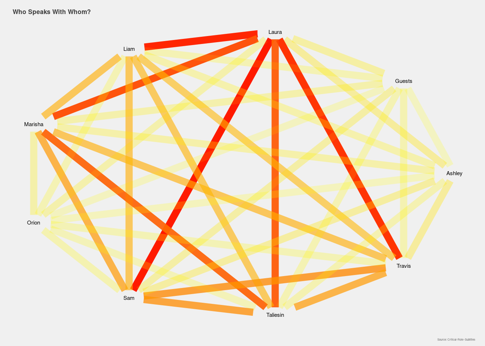

However, one liners may not only come from on actor but multiple actors
simultaneously. In the subtitles this may be shown by as follows:
“Ashley and Laura: no no no no!”. So lets see how has the same thoughts.
Similarly, to the interactions earlier, we can see that Laura has indeed
the most shared thoughts with her cast members, indicating that she
indeed off character comments the most. Again, Marisha and Taliesin have
the same ideas when it comes same thoughts. Similarly, the same applies
to Ashley, Laura and Travis or Sam and Taliesin. It also becomes obvious
that the cast is more likely to have the same thoughts as it rarely
happens that guests save the same thing as the cast simultaneously.

    ## Error in graph_from_data_frame(d = same_thought_network, vertices = nodes_thought, : Some vertex names in edge list are not listed in vertex data frame

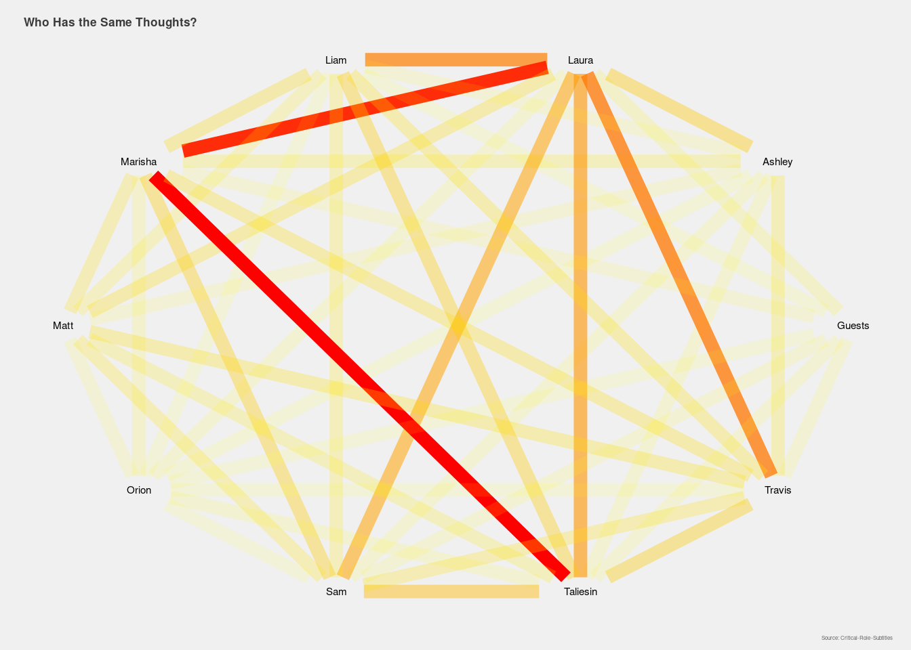

The text can also be used to examine, which character is the most happy
or sad. To do so, dictionaries can be used, which assign words a
positive (happy) or a negative (sad) value. These values can then be
used to examine which characters are the most happy and sad. This will
give you some indication, which character has the most happy or sad
dialogues. So be wary of spoilers (and mimics) from now on.

Looking at the sentiment of the different actor some differences become
apparent. One the one hand, Matt stands out as being the happiest of the
bunch. This may likely be because he also has the most text and time he
says while describing the scenes. Additionally, most of the NPC he
describes are more of the happy type. Additionally, it becomes obvious
that Liam plays the saddest character from the group. This maybe because
he is always worried about his sister, his death. However, he also
stated that dungeons and dragons serves as an outlet for him. Behind
this background the score may be understandable. Personally, I found the
high score for Marisha surprising as I remembered her to be a bit more
reserved in the earlier episodes. But it looks like she made up for it
in later Episodes (anybody remembers the wine incident?).

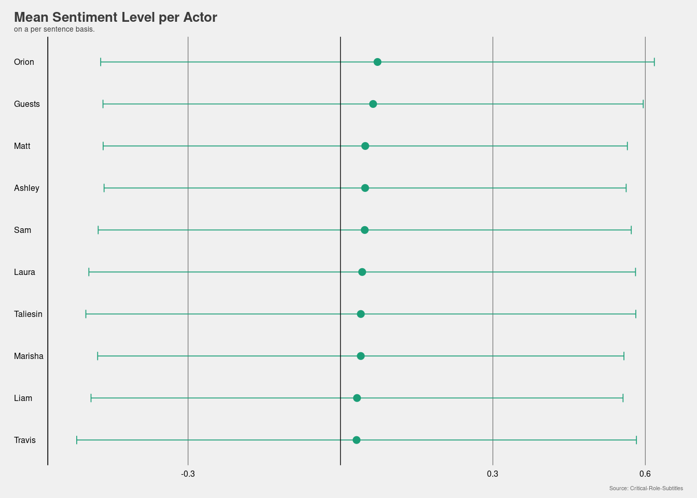

The same methodology can be used to analyse the entire arcs. Looking at
the data the values we can see that the first two arcs were happier
compared to the middle ones. Later arcs became happier again. This also
matches my personal experience from watching. After a happy start and
everybody getting accustomed to streaming and watching dungeons and
dragons on a live stream, the story took a darker turn with the
Briarwoood arc. Afterwards, the attack of the Conclave also made for a
dire mood. However, finding the vestiges gave the group some heroic
moments and brighten the mood (anybody looking to buy some suude?). The
following fight with Conclave and the fallout thereof let to some
sweating moments for audience and actor alike. Before during the last
two arcs loose ends were tied together.

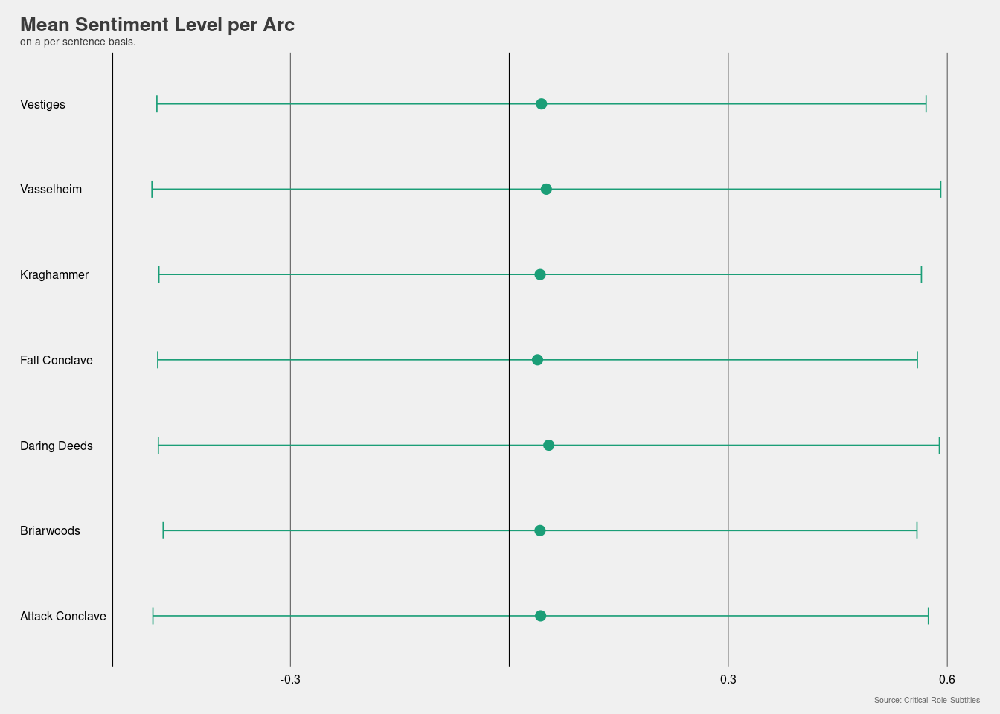

So far we looked at the sentiment across arcs. Similarly to the
comparison in miss spellings the comparison may not be fair. After all,
if combat was more prevalent in one arc compared to another, chances of
failure and character deaths are increased for this arc. So lets look at
the length of combat and role playing for the different arcs.
Interestingly, the time spent for both parts of the shows is rather
constant across arcs and always around one to four. This probably
mirrors the experience with many people playing a role play heavy
campaign. However, this means that combat may not be the driving factor
behind low sentiment scores but can be found in role play as well
(Draconia anyone?). After all some funny moments were happening during
combat as well (). This brings us to the more interesting question:
which episodes are the most happy or sad, and thus worth a rewatch?
Note: biggest spoilers ahead

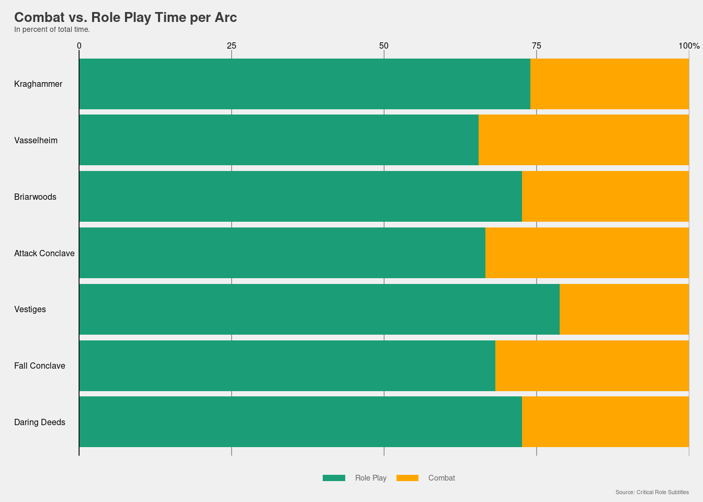

*note the numbers and content have to be checked again after numbers are
fixed - 12 does not make sense*

Looking at the most fun episodes, it becomes obvious that second early
episodes are the ones with best scores. Additionally, the other three of
the top 5 episodes are from the same seventh arc, namely *Daring Deeds,
Deals, and Destinies*. These include the first full episode of Sam’s
second character Taryon (86), Taryon and Grog’s first ever shopping tour
and the end of Keyleth’s Aramenté (90) and the beach vacation (95).

In contrast, the bad episodes are more evenly distributed around arcs.
The worst episode is 68, where the groupcatches up with Rippley and the
Percy’s past comes to a close. 114 is the second last episode where the
story of Vox Machina comes to a close. Both 52 and 55 are episodes in
the attack of the conclave arc. In 52 the group comes to the rescue of
Grog after he is unable to defeat his uncle by himself. In 55 the group
is facing off on the back of the ancient black dragon Umbrasyl in a
fight for life and death. In 79, the party faces of against the head of
the Chroma Conclave Thordak, in which Gilmore is badly wounded.

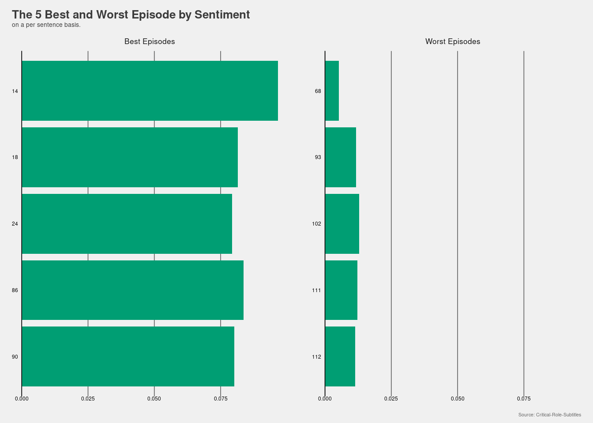

    ## `geom_smooth()` using formula 'y ~ x'

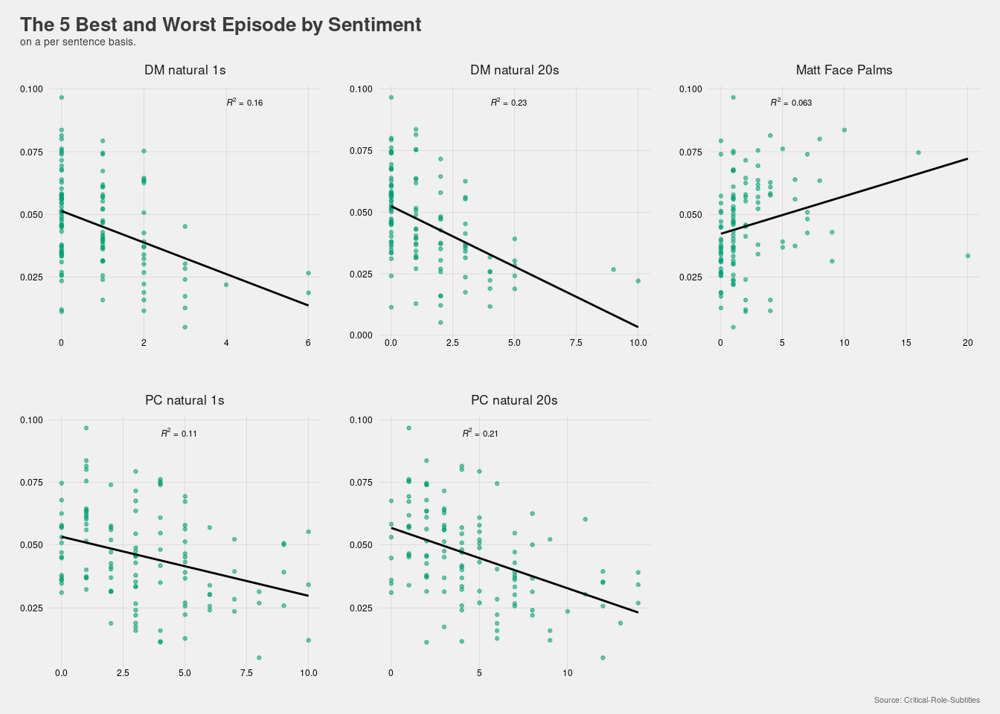

    ## `geom_smooth()` using formula 'y ~ x'

Acknowledgements

-   [Critical Role](https://critrole.com/team/)

-   [Critical Role Transcript
    Team](https://crtranscript.tumblr.com/about)

-   [Critical Role Stats Team](https://www.critrolestats.com)

### References:

R. Rameshkumar and P. Bailey. Storytelling with Dialogue: A Critical
Role Dungeons and Dragons Dataset. ACL 2020. Accessible at: [GitHub -
RevanthRameshkumar/CRD3: The repo containing the Critical Role Dungeons
and Dragons Dataset.](https://github.com/RevanthRameshkumar/CRD3)

### Licence:

This work is licensed under a \[Creative Commons Attribution-ShareAlike
4.0 International License\]\[cc-by-sa\]
