# Critical Graphs: Shenanigans with Critical Role Season 1 subtitles

With the end of season two approaching, it is time to look back on the
humble beginnings of the show “Critical Role”. What is “Critical Role”
you ask? To use their own words: it’s a bunch of nerdy ass voice actors
who sit around and play Dungeons and Dragons. Thousands around the world
tune in to watch them [live](https://www.twitch.tv/criticalrole) and
millions view their shenanigans later on
[YouTube](https://www.youtube.com/criticalrole). The fact that nothing
is scripted makes this show so thrilling to watch: as nobody writes out
an episode beforehand, whatever happens is up to the players and the
dice to decide. Everything is possible and only happens in the
imagination of the players and the viewers. That’s what makes it so
intriguing to watch. The creativity also makes the show interesting for
some nerdy ass data analyses. Be aware: minor spoilers ahead.

The large online community of the show provided subtitles for every
episode of the first season. These can be used to construct data sets,
which we then can use for analyses of language, text and interactions
during the show. Rameshkumar and Bailey (2020) use these to construct a
data set to test models, which predict the text word of a text (similar
to what you may find in your phone when typing a message). The
unscripted nature of the show makes the dialogue less predictable than
other text and therefore makes it a good test for these algorithms.

However, Rameshkumar and Bailey’s approach omits time stamps from the
data and focuses on dialogue entirely. While this approach is reasonable
when predicting the next word, leaving out time from the data excludes
interesting information. For example, one may potentially use the
subtitles and the videos of the episodes to train a neural network,
which then act out an entire episode in the future. This is, however,
far beyond the scope of this blog post. Instead, we will examine at
descriptive statistics to look back on the first season of the series.

In total the subtitles for the first season cover over 431 hours of game
play and contain roughly 3.4 million words. A typical episode might
start with the game master Matthew Mercer saying: “Hello everybody and
good evening. Welcome to Critical Role.” In the subtitles this looks as
follows:

> 00:00:00,500 –&gt; 00:00:04,043 MATT: Hello, everyone and good
> evening. Welcome to Critical Role, a show where a bunch of us
> 00:00:03,307 –&gt; 00:00:06,503 nerdy-ass voice actors sit around and
> play Dungeons & Dragons.

The numbers indicate the time during which a subtitle is shown on the
screen. Doing some coding and data cleaning we can turn this into a
nicer format, which ultimately looks as follows:

<table class="table" style="margin-left: auto; margin-right: auto;">
<thead>
<tr>
<th style="text-align:right;">
Episode
</th>
<th style="text-align:left;">
Segment
</th>
<th style="text-align:right;">
Start\_Turn
</th>
<th style="text-align:right;">
End\_Turn
</th>
<th style="text-align:left;">
Actor
</th>
<th style="text-align:left;">
Text
</th>
</tr>
</thead>
<tbody>
<tr>
<td style="text-align:right;">
100
</td>
<td style="text-align:left;">
Prologue
</td>
<td style="text-align:right;">
0
</td>
<td style="text-align:right;">
6.503
</td>
<td style="text-align:left;">
Matt
</td>
<td style="text-align:left;">
hello everyone, and welcome to tonight’s episode of critical role, where
a bunch of us nerdy-ass voice actors sit around and play dungeons and
dragons.
</td>
</tr>
</tbody>
</table>

To achieve this, we have to extract the speaker from the text and
combine the different parts of the text into one. Unfortunately, not
every volunteer followed the same naming convention. For example, when
the game master, Matt, is acting as a character in game, this can either
be written in the subtitles as the character’s name (say, ‘guard 1’) or
as ‘Matt’. The same applies for the players, who may be referred to by
their name or their character’s name. Additionally, as is inevitable
when transcribing long spoken text (an average episode is 3.8 hours
long), people make mistakes. Which brings us to the first interesting
question to ask: which actor got misspelled the most? This can give an
indication of how useful the subtitles are when examining the series is
further detail.

Out of the cast, Marisha got misspelled the most. These include, for
example, ‘Marishaia’ or ‘Marishaaaa’. However, she was not alone in her
fate. For example, Travis, playing a character named Grog, sometimes got
misspelled as ‘Tavis’ or as ‘Gorg’. The examples highlight that the
subtitles are not made by a professional subtitle writer, but instead by
dedicated fans of the show. Yet, taking everything together, the amount
of misspells for all the subtitles is astonishingly low. Over 115
episodes and a more than episodes and more than four hundred hours of
content the total amount of misspells is only 150. In summary, the fans
have shown a great eye for details when transcribing the episodes.
Hence, we can confidentially use the subtitles for more analyses.

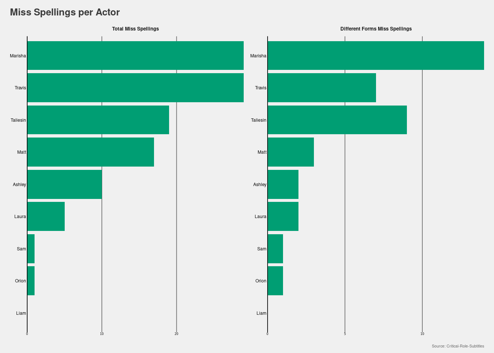

The graph above directly compares the miss spellings of the different
actors. However, a direct comparison may be unfair because not every
actor has the same chance of being misspelled. This is because of two
reasons: first, not every actor was present for all episodes. Second,
not every actor spoke for the same amount of time. While Matt, as the
game master, must be present for every episode and has to describe
everything that happens in game, other actors can give short answers or
sit out an episode. So, let’s look at both attendance and the amount of
dialogue in turn.

Examining the attendance by the players some differences stand out: Out
of the eight players, five didn’t miss more than 5 out of the total 115
episodes. Meanwhile, Ashley was only present for less than half of the
episodes. Similarly, Orion only participated in every fifth episode
because he left the show after only a quarter of the episodes. Hence, it
seems reasonable that he got misspelled less compared to many of the
other cast members. We can also see that about one in five episodes
guests joined the show.

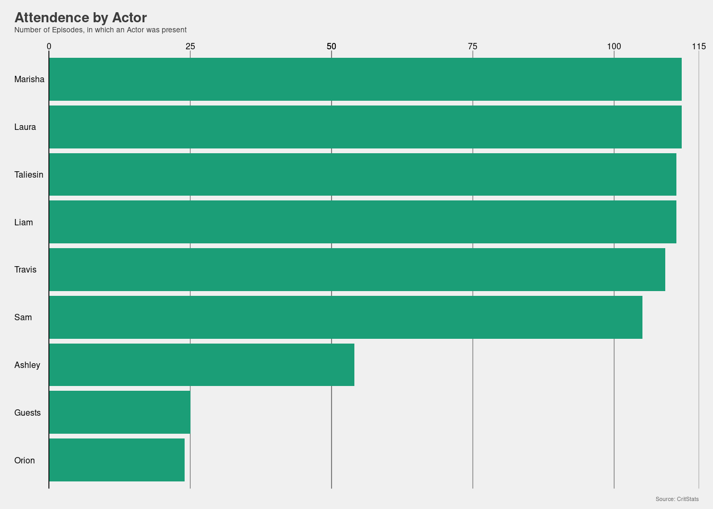

Now let’s look at the amount of time the actors speak. We can do so in
three different ways. First, we can look at the time a cast member
speaks. Second, we can examine the number of words as metric to compare
the amount of speaking of the different players. Third, we can use the
number of turns for each actor. Turns are numbers indicating the number
of changes for which person speaks. For example, turn one might be Matt
saying “hi”. Turn two might be Liam responding with “hi, how are you
doing?”. All three measure give us some indication on much different
actors speak. While the time an actor speaks tells us how much time they
say something compared to the rest of the cast, the number of turns can
tell us how often they speak. Last, the number of words used tells us
how often the actors say something.

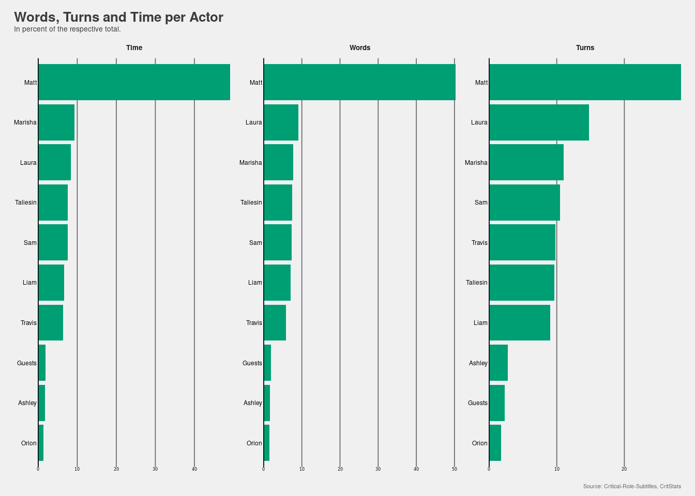

Unsurprisingly, the graph above shows that Matt speaks most of the
group. After all, a game master must describe how everything looks and
feels in game. He acts out non-player characters and their reaction to
the actions of the players. Lastly, he describes how the actions of the
characters are playing out in the imaginary world. In total, he speaks
half of the time and says half of all words. However, he only uses
roughly very fourth turn to do so. This may be surprising as, especially
in combat, every turn by a player is usually followed by a description
by Matt. However, this also indicates how important role play among the
players is for the series (we will investigate the significance of role
play later in more detail when we look at the different arcs of the
story).

Like in the miss spellings, we examined above, Marisha tops the list of
time spoken compared to the other players. Interestingly, both Ashley
and Orion only speak roughly the same as all guests of the show
combined. This is a testament to the fact that they’re not present for
all episodes. Laura uses more words than Marisha even though she speaks
for less time. Moreover, we can see that she uses more turns compared to
any other member of the cast. This may imply that she speaks at a
quicker pace compared to the other cast members. However, as we can see
in the graph below, this is not the case. Instead, Orion speaks the
fastest at a speed of 200 words per minute.

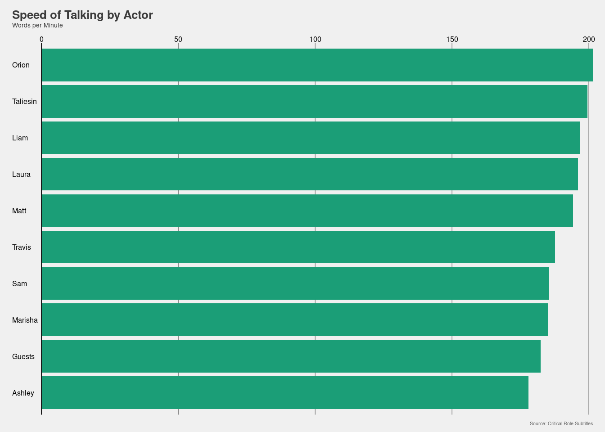

Yet there is a catch to these numbers, as not everything that is said is
shown in the subtitles. Sometimes many people speak at the same time. If
that happens only the important parts are written in the subtitles. This
affects the calculated time the actors speak, as it is measured by the
time subtitles are shown on the screen. For example, a long description
from Matt may span over 30 seconds. If one of the players were to
comment on the scenery at the same time it may be omitted from the
subtitles.

Despite these shortcomings, we can still look at the most used words per
actor to see if players use a set of unique words often. To do so we can
calculate the log-odds ratio for the words used by the players. A high
log-odds ratio tells us that if a given spoken text contains a specific
word, it is more likely to be said by a certain cast member. For
example, the graphs below show that if a text contains the word
‘inspire’ it is likely to be said by Sam who plays the bard Scanlan. As
‘inspire’ is a class ability of bards, it is not surprising that Sam
uses that word that often. Similar relationships between class abilities
and what the player said can be found for almost all players. Among
others, Laura’s list contains parts of the iconic ranger ability
“hunter’s mark”, while Travis’ includes the barbarian ability
“reckless”. Taliesin’s “sharpshooter” feat and can be seen in the graph.

Moreover, it is unsurprising to find Matt use ‘you’ more often compared
to the rest of the cast as he is describing the actions of players. For
example, if players want to attack an enemy, they have to roll to see
whether the action succeeds. Upon rolling, Matt tells players and
audience alike how the rolls play out in game. Likewise, the fact that
many of the top five words contain the word ‘I’ or variants thereof show
that players describe what they want to do while Matt describes to them
how it plays out. More advanced statistical methods, like random forests
or decision trees, can be used to examine the relationship between words
and actors in more detail. However, these require a more in-depth
conceptional understanding. Thus, I will discuss in a future blog post.

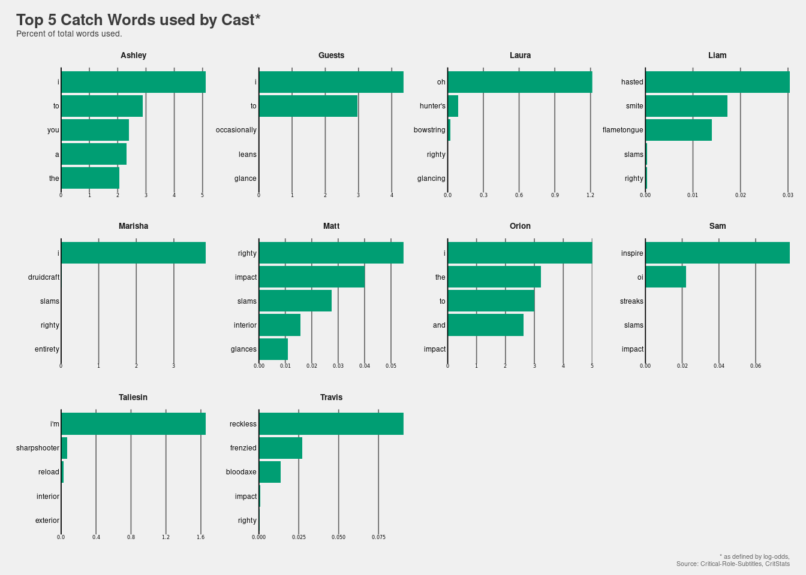

What we can do easily though is to investigate, which cast member used
the most elaborate vocabulary. A commonly used measure to examine the
readability of text is the [Coleman–Liau
index](https://en.wikipedia.org/wiki/Coleman%E2%80%93Liau_index). It
uses the number of words, letters, and sentences to calculate a score,
which then can be translated into grades. Score of five or below
indicates very easy to read text and can be used for kids in
5th grade or below. A score of six characterizes text, which
is easy to read and can be used for children in grade 6. Higher scores
can be translated into school grades in a similar fashion.

As we can see in the graph below, the show is easy to follow. This is
hardly surprising as it is essentially one long conversations between
cast members. As most of us don’t speak like academic papers are written
this results in a good readability of the dialogue. The only member of
the crew, who scores higher than a six on average is Matt. This is to be
expected as he has to flesh out the world for everyone. In contrast, all
the players get a mean score of 4 or below. Only Talisien achieves a
score of four. Maybe surprisingly, Ashley has the easiest to follow
text. However, this could also be because Ashley is only present for
half of the episodes and her character, Pike, is rather shy. Please
note, in the interest of keeping this light on spoilers, I intentionally
do not differentiate between different characters played by the same
actor. Some of the differences may be driven by players playing
different characters throughout the show. That said, only a few players
change characters throughout the show and should therefore not influence
the results significantly.

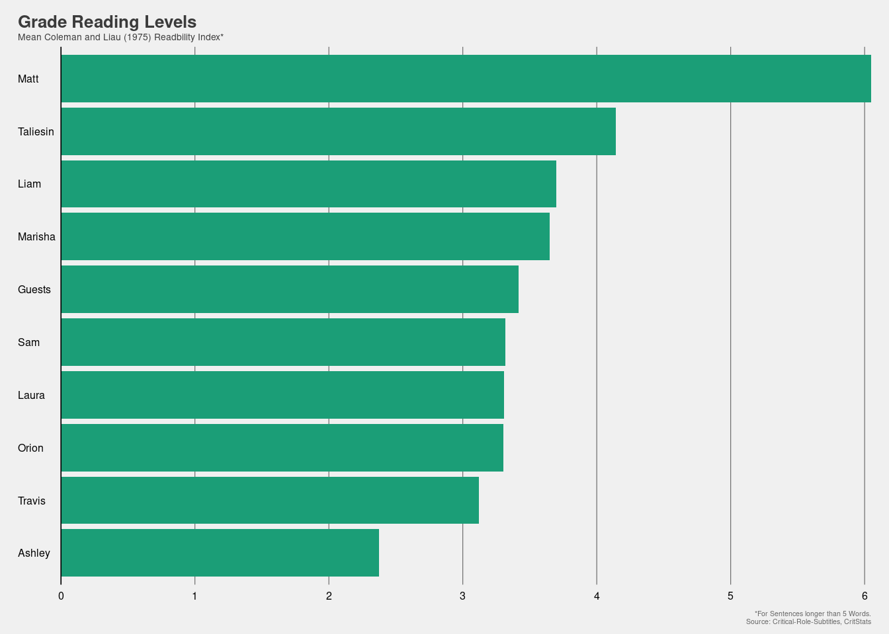

So far, we have only looked at each actor individually. As Dungeons and
Dragons is an interactive experience, this seems restrictive. The graph
below maps out interactions between players. In total, we see that Laura
has the most interactions with everybody. Surprisingly, given how the
story evolves, she interacts with Taliesin the least out of the regular
cast. Likewise, Marisha interacts more with Taliesin than with Liam.
However, we can see that Travis often speaks before and after Sam, who
act as kind of the chaos duo during the show (anybody looking for
Suude?). Moreover, we can also examine whether people, who sit nearer to
each other talk to each other more often. This does not seem to be the
case (the correlation coefficient is -0.11). It will be interesting to
examine the interactions in season two as well, as both, the characters
played by the actors and the seating arrangement, was changed in the new
studio.

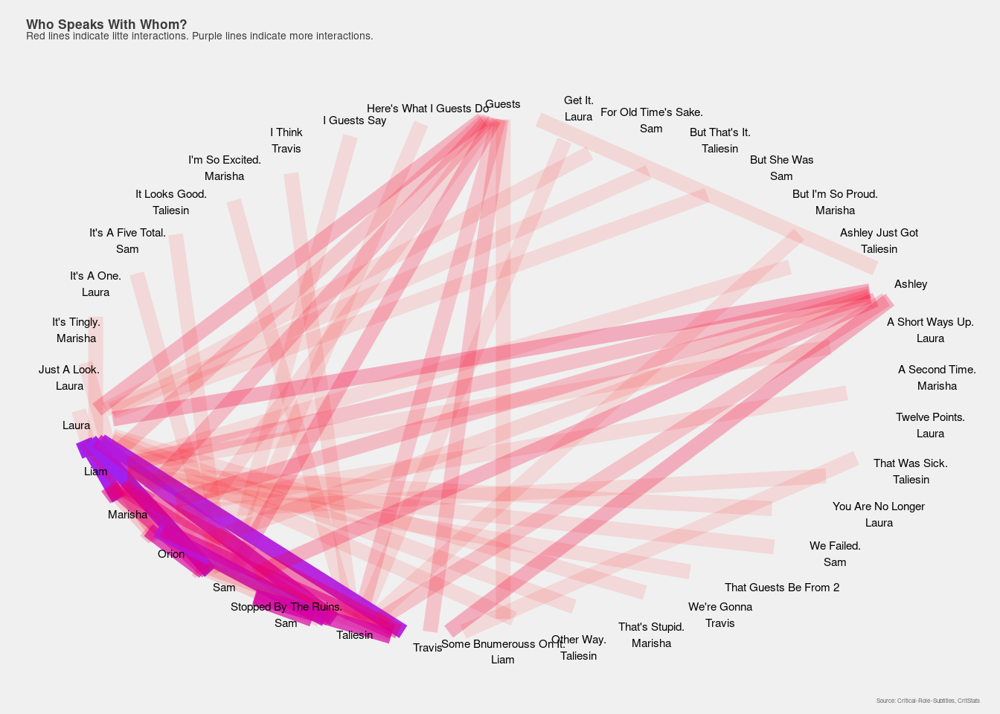

Like the analyses before, there are some caveats to the results though.
Interactions as shown in the graph are measured by counting when actors
speak after each other. As we have seen earlier, Orion and Ashley did
not participate in all episodes. Simiarly, as Liam and Travis speak the
least the results presented below mirror our previous findings. However,
as we have seen earlier, Laura does not speak often (timewise) compared
to other members of the cast. Thus, the number could be influenced by,
among other things, Laura giving short comments throughout the show.
Let’s see whether that’s the case. Indeed, on average a segment from her
only contains 9.2 words, while average for all players is 11.8. This may
imply that the results shown above are indeed inflated by Laura
commenting while other cast members speak. As a side note, given the
role of Matt everybody interacts with him the most. Therefore, Matt is
not shown in the graph above.

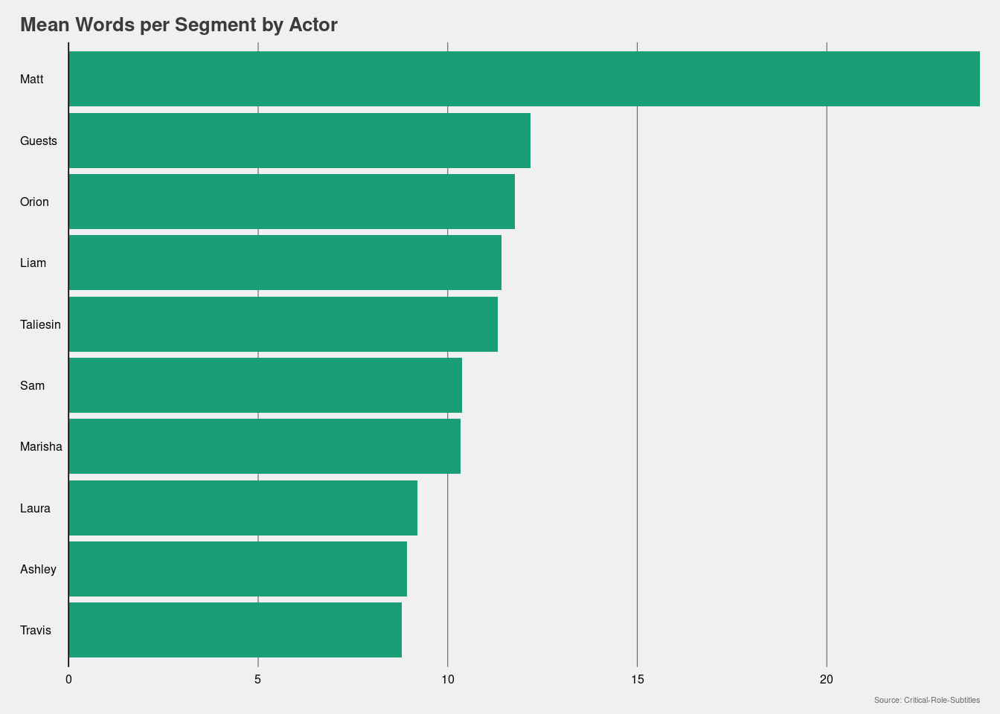

Sometimes actors may say precisely the same thing simultaneously: For
example, when a party member is close to dying in a fight, they may have
the same reaction. In the subtitles this may be shown as follows:
“Ashley and Laura: no no no no!”. So, let’s examine who tends to say the
same thing at the same time.

Similarly, to the interactions earlier, we can see that Laura has the
most shared spoken text with her cast members, indicating that she
indeed has the briefest comments from the group. Out of the cast, she
and Marisha often share the same thoughts out loud. Marisha and Taliesin
often share the same ideas as well. The same applies to Ashley, Laura
and Travis or Sam and Taliesin respectively, though to a lesser extent.
Interestingly, Matt never says the same thing at the same time with a
guest.

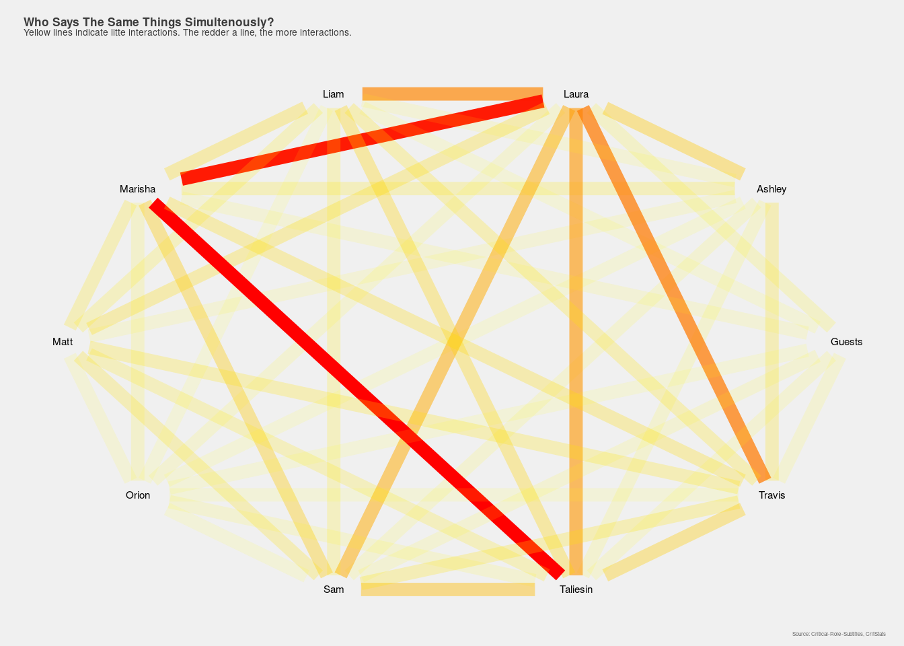

So far, we focused entirely on the cast. While this interesting, for
fans, who finished both season one and two, the more interesting
question might be: which episodes and arc should I watch again? We can
use sentiment analysis to examine, which character, arc or episode is
the most happy or sad. To fully understand a human being, non-spoken
elements such as body language matters a lot too. However, the approach
can be used to give us a rough first indication. When applying sentiment
analysis, we which assign specific words or sentences happy or sad
sentiments using the Lexicoder Sentiment Dictionary. Using this
dictionary, higher values indicate a happier dialogue. These values can
then be used to examine which characters express themselves in the
happiest and the saddest way. As we have seen earlier, different actors
have different speaking times. Thus, to make it comparable, let’s look
at the mean sentiment of sentences spoken per actor. As this will give
us some hints towards the personal journey of characters, be wary of
spoilers (and mimics) from now on.

Looking at the sentiment scores from actors some differences become
clear. To begin with, Liam and Travis seem to be playing the saddest
characters. For Liam this hardly seems surprising as he previously
stated that Dungeons and Dragons serves as an outlet for him. For Travis
this may be because Grog often gets told he cannot do a lot of stuff or
because he plays the character with the lowest intelligence. In
contrast, the guests seem to be happier than most of the cast. This may
be because they are happy to play with the group or that Matt
intentionally makes episodes starring guests more light-hearted.
Likewise, Ashley seems to be the good heart of the group. Yet, Orion
stands out as the happiest of the cast. This is a bit surprising as he
is only present in the first episodes. However, as viewers of the first
season know, the story gets darker after his departure. To quantify
this, let’s investigate whether later arcs are indeed less happy
compared to the earlier ones.

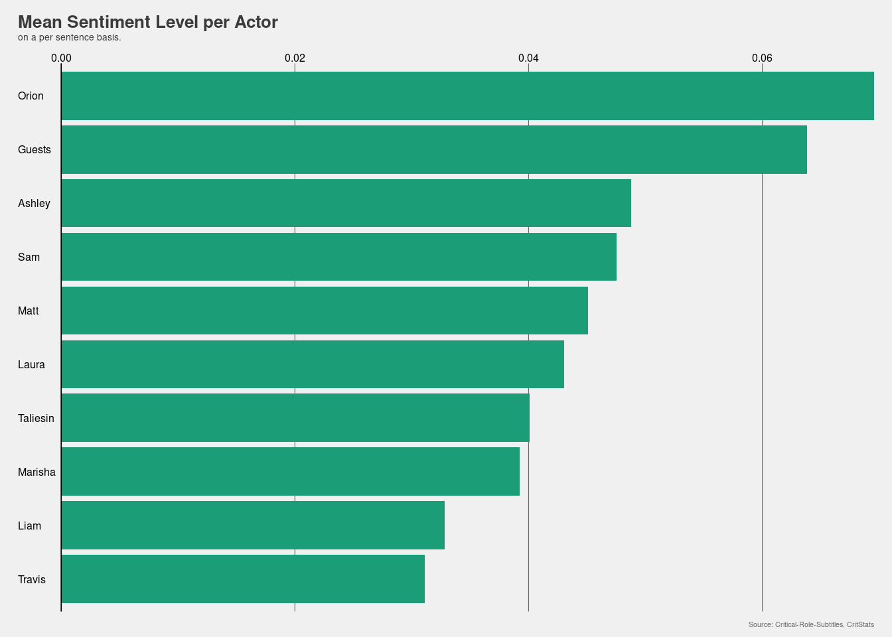

Examining the mean sentiment per episode for the different arcs we can
indeed see that the first two arcs were happier compared to most other
ones. After a happy start and everybody getting accustomed to streaming
and watching Dungeons and Dragons on a live stream, the story takes a
darker turn. The exception to this rule is the ‘Daring Deeds’-arc. This
seems hardly surprising for viewers of the show given how a new
character was introduced and how the story develops during their
presence. In the interest of keeping this text light on spoilers, let’s
not drive into the story any further. Instead let’s investigate whether
the difference in sentiment was driven by differences in the amount of
combat. As more combat represents higher chances of dying, this may be a
driving force behind the differences between the arcs. Luckily, the team
at [<u>CritStats</u>](https://www.critrolestats.com/) keep track of the
time spent in combat.

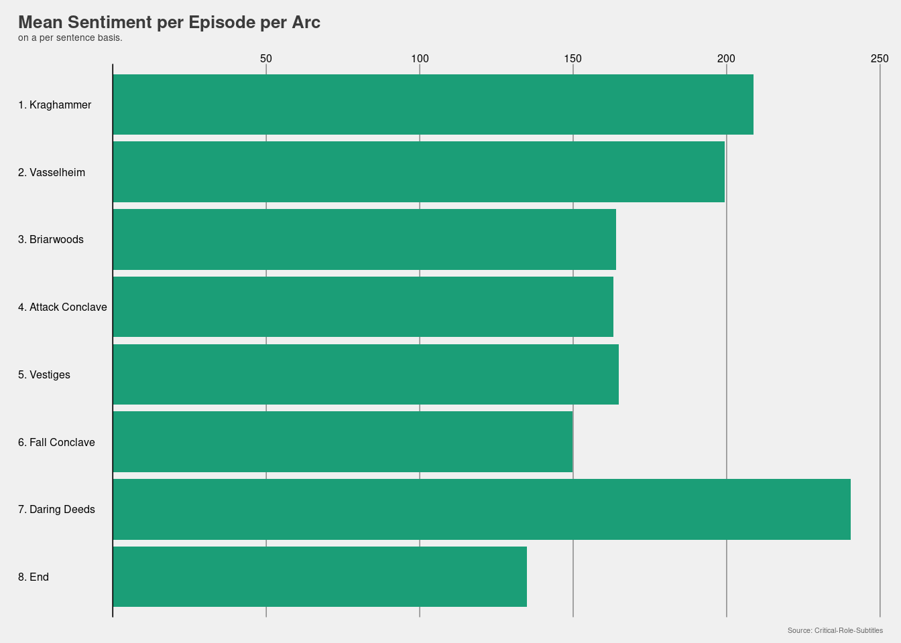

As we can see below, the earlier arcs had more time dedicated to combat.
During the search for the Vestiges of Divergence the time spent in
combat is the lowest (20percent). In the last three arcs, around a
quarter of the time was dedicated to combat. However, this means that
combat may not be the driving factor behind sad moments in the story but
can be found in role-play as well. Thus, it could be that in the
beginning of the show players were less comfortable with the rules as
they use a different rule set when they started to play onscreen.

Additionally, before streaming, the group didn’t play on a set schedule.
Consequently, it seems likely that the players got more used to playing
their characters and the abilities they have. Thus, estimated time does
not necessarily reflect the in-game time in combat. To investigate the
issue further let’s look at the happiest and saddest episodes to see
whether they involve combat. As these episodes may also be the ones
which drive much of the story forward the next paragraph contains
spoilers for the uninitiated (but may also be worth to be watched
again).

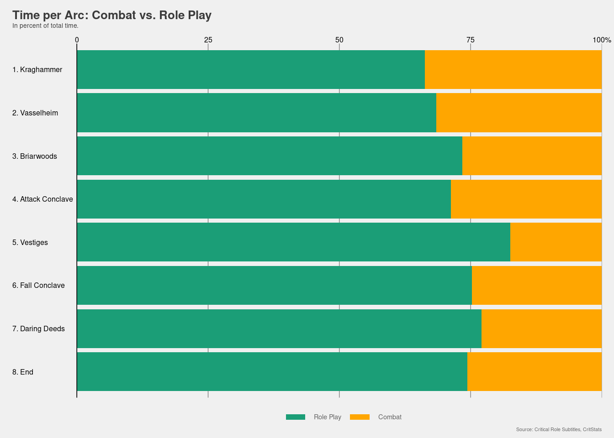

Looking at the happiest episodes a lot of the findings we have gathered
so far come together. On the one hand, the top scoring episode involves
the introduction of the already mentioned new character. Additionally,
episode 95 involves the reunion after a one-year break in game and is
more light-hearted. Yet, the other three episodes involve combat and
guests. While episode 11 involves a lot of (useless) planning while
attacking a temple, episode 88 involves fighting a kraken. Moreover,
episode 18 involves two guests and parts of the cast absent. This ties
in nicely with the results we obtained earlier that guests were
genuinely happy to team up with Vox Machina.

In contrast, most of the saddest episodes involve combat. This is
surprising given that we found earlier that combat and sentiment are not
related on when we examined entire arcs. Yet, as an arc contains
multiple episodes the relationship was masked by averaging the numbers.
The saddest episode (51) even has a negative score, meaning that the
average sentences spoken during the episode has a sad connotation. It
involves planning to help the child of one character to escape a city,
while simultaneously fighting the uncle of another. Episode 68 features
the fight against an antagonist and the death of one of the characters.
As the other episodes on the list take place during the last arc and are
preparation for the final boss fight, I will not discuss them in more
detail. Instead, let’s look in more detail what drives the sentiment of
an episode. So far, we have seen that the guests and Ashley had the
happiest sentiment. We have also seen that time spent in combat and
sentiment do not seem to be related when looking at entire arcs.
However, having obtained mixed signals when looking at individual
episodes, let’s investigate what exactly makes a happy or sad “Critical
Role”-episode.

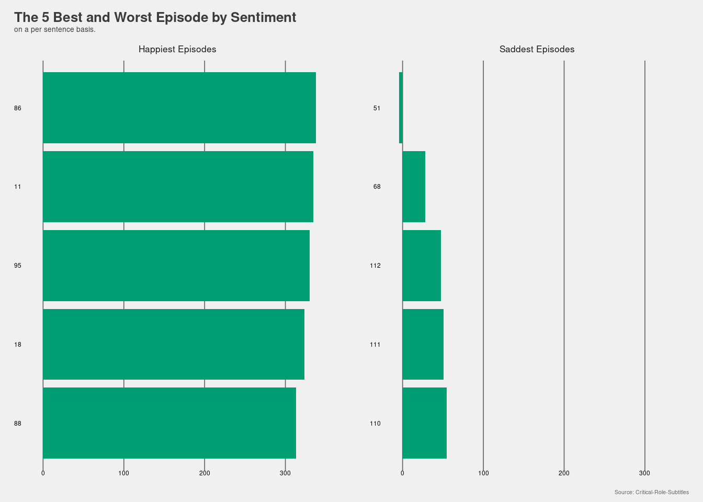

First, let’s see whether episodes starring Ashley and guests are happier
compared to episodes without. As we have seen earlier both, guests and
Ashley had higher sentiment scores compared to the rest of the group. We
might expect this to translate to happier episodes in general. However,
when we run correlation tests, we find insignificant results. This means
that episodes starring Ashley or a guest are not different from episodes
without them when it comes to sentiment.

In contrast, the time spent in combat does seem to negatively effect the
sentiment of an episode. Using a OLS estimation, while holding the
length of episodes constant, we can estimate the effect. We find that
one hour spent in combat is associated with a decrease 27.21 in the
sentiment score of the episode. Given that an average episode has a
sentiment score of 176 and an average combat lasts for 1.4 hours this is
a significant effect. Yet, as success in Dungeons and Dragons is
dependent on the dice rolls made, let’s investigate the effect of those
on the sentiment as well.

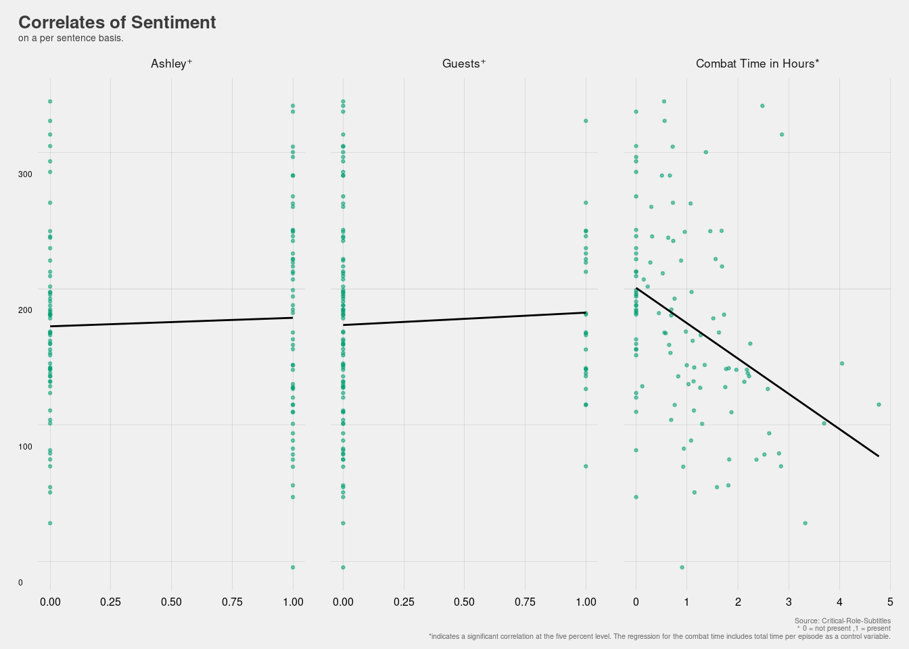

When we look at all the rolls made during the combat, we don’t find any
relationship between dice rolls and happy sentiments (see first panel in
the graph below). Yet, as always there is a caveat to these numbers. As
players gain in levels, they also roll higher as they character get
stronger. At the same time, they must achieve higher rolls to be
successful as well. Thus, a high roll when modifiers are applied do not
yield the same excitement in later episodes compared to later ones.
Hence, we can only use the natural value rolled for the average of all
dice rolls. However, this reduces the total number of dice rolls
significantly as not often we only know the total outcome (meaning
including abilities modifiers). Still, we often know when the players
and the dungeon master roles a critical success (20 on 20-sided die) or
a critical failure (1 out of 20). We can use these to investigate the
relationship between dice rolls and the sentiment of an episode. Yet,
when we run the numbers, we don’t find associations between critical
rolls and the sentiment of episodes. Similarly, the number of face palms
by Matt does not seem to be a good indicator either.

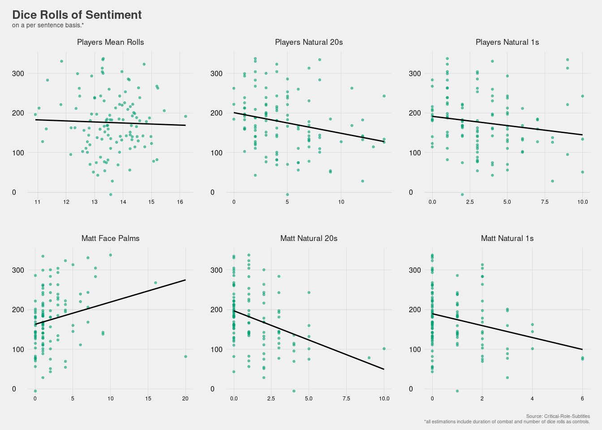

In summary, we can say that subtitles for Critical Role can be used for
some funny data analyses. Taken together they can give some interesting
insight into the show. So far, we only used the data for mostly
descriptive analysis. However, they can also be used to for more
technical application as Rameshkumar and Bailey (2020). In the future I
plan on using the data for some shenanigans in applied machine learning
myself. I will try to predict the speaker of a text given the words said
in a later post. This task of classifying text is one of standard use
cases for natural language processing (NLP) - the branch of machine
learning concerned with processing text and speech. Given the size of
the data set (around 270,000 classified snippets of text) and the fact
that show is unscripted makes this an interesting application for NLP.
So, if anybody is interested in applying some analyses to the text you
may code away. My biggest thanks go out to the cast of “Critical Role”
and all the volunteers, who provided the subtitles and statistics.

The code and the data set can be found on github.

### Acknowledgements

-   [Critical Role](https://critrole.com/team/)

-   [Critical Role Transcript
    Team](https://crtranscript.tumblr.com/about)

-   [Critical Role Stats Team](https://www.critrolestats.com)

### References:

R. Rameshkumar and P. Bailey. Storytelling with Dialogue: A Critical
Role Dungeons and Dragons Dataset. ACL 2020. Accessible at: [GitHub -
RevanthRameshkumar/CRD3: The repo containing the Critical Role Dungeons
and Dragons Dataset.](https://github.com/RevanthRameshkumar/CRD3)

### Licence:

This work is licensed under a \[Creative Commons Attribution-ShareAlike
4.0 International License\]\[cc-by-sa\]
